<!-- markdownlint-disable MD022 MD032 MD033 -->
# James Priest

## 100 Days Of Code

| Log 1 | Log 2 | Log 3 | Log 4 |
| --- | --- | --- | --- |
| [100 Days Round 1](https://james-priest.github.io/100-days-of-code-log/) | [100 Days Round 2](https://james-priest.github.io/100-days-of-code-log-r2/) | [100 Days Round 3](https://james-priest.github.io/100-days-of-code-log-r3/) | this log |

## Challenge & Commitment
This is part of Alexander Kallaway's [100DaysOfCode](https://github.com/Kallaway/100-days-of-code "the official repo") challenge. More details about the challenge can be found here: [100daysofcode.com](http://100daysofcode.com/ "100daysofcode.com").

**Commitment:** *I will code daily for the next 100 days.*

|  Start Date   | End Date     |
| ------------- | ------------ |
| October 5, 2018   | - - - |

## Goals

- [x] Code daily
- [x] Complete Udacity's [Grow with Google Challenge Scholarship](https://www.udacity.com/grow-with-google) - Mobile Web Specialist
- [x] Get accepted to the Google Udacity [Mobile Web Specialist Nanodegree](https://www.udacity.com/course/mobile-web-specialist-nanodegree--nd024) program
- [x] Successfully complete the Google Udacity [Mobile Web Specialist Nanodegree](https://www.udacity.com/course/mobile-web-specialist-nanodegree--nd024) program
- [ ] Pass the Google [Mobile Web Specialist Certification](https://developers.google.com/training/certification/mobile-web-specialist/) exam for Mobile Web Development
- [ ] Pass the Microsoft Programming in HTML5 with JavaScript & CSS3 Cert - [Exam 70-480](https://www.microsoft.com/en-us/learning/exam-70-480.aspx "Exam 70-480: Programming in HTML5 with JavaScript and CSS3")

# Code Log
<!--

## 1.
### Day 1: January,10 2018 - Saturday

**Project:** Mobile Web trackS

**Progress:**

**Thoughts:**

**Link to Work:**
---

## 1. Create New Code Log
### Day 1: May 9, 2018 - Wednesday

**Project:** Google Udacity Nanodegree (Mobile Web Specialist)

[](https://james-priest.github.io/udacity-nanodegree-mws/assets/images/full-size/rwdf5-23.png)

**Progress:** Completed *Lesson 5: Optimizations* from the Udacity course: [Responsive Web Design Fundamentals](https://www.udacity.com/course/responsive-web-design-fundamentals--ud893).

This lesson dealt with how to adapt:

- Responsive tables for mobile (hidden columns, contained scrolling, block elements)
- Font sizing across different viewports
- Images resolution based on device pixel density
- Minor breakpoints

Read more: [Notes - Responsive Web Design Lesson 5: Optimizations](https://james-priest.github.io/udacity-nanodegree-mws/course-notes/responsive-web-design-fundamentals.html#lesson-5-optimizations)

**Links:**
- My Course Notes - [Responsive Web Design Fundamentals](https://james-priest.github.io/udacity-nanodegree-mws/course-notes/responsive-web-design-fundamentals.html)
- Udacity's [Responsive Web Design Fundamentals by Google](https://www.udacity.com/course/responsive-web-design-fundamentals--ud893) (free 2 week course)

---

-->
---

## 95. Redux - Course Intro
### Day 95: February 18, 2018 - Monday

**Project:** [Udacity React Nanodegree Program](https://www.udacity.com/course/react-nanodegree--nd019) and [Udacity Introduction to Python Programming](https://www.udacity.com/course/introduction-to-python--ud1110)


[](https://james-priest.github.io/udacity-nanodegree-react/assets/images/rr2.jpg)

**Progress:** Started Udacity Redux lesson for my React Nanodegree Program.

Looks like this course is going to be split up into the following lessons:

- Lesson 1 - Managing State
- Lesson 2 - UI + Redux
- Lesson 3 - Redux Middleware
- Lesson 4 - Redux with React
- Lesson 5 - Asynchronous Redux
- Lesson 6 - react-redux
- Lesson 7 - Real World Redux

You can read more in my notes: [Udacity React & Redux - 1. Managing State Intro](https://james-priest.github.io/udacity-nanodegree-react/course-notes/react-redux.html#1-managing-state)

I also started [Intro to Python Programming](https://www.udacity.com/course/introduction-to-python--ud1110) and am learning the basics of the language such as: 

- Arithmetic operators
- Variables
- Assignments

**Links:**
- Course notes - [Udacity React & Redux](https://james-priest.github.io/udacity-nanodegree-react/course-notes/react-redux.html#react--redux)
- Link to [Udacity React Nanodegree Program](https://www.udacity.com/course/react-nanodegree--nd019)
- Link to [Udacity Introduction to Python Programming](https://www.udacity.com/course/introduction-to-python--ud1110)

---

## 94. React Bookshelf Project Code Review & Fix
### Day 94: February 16, 2018 - Saturday

**Project:** [Udacity React Nanodegree Program](https://www.udacity.com/course/react-nanodegree--nd019)

[](https://james-priest.github.io/reactnd-project-myreads/assets/images/p14.jpg)<br>
**Live Demo:** [reactnd-project-myreads@10-code-review-enhancements](https://codesandbox.io/s/github/james-priest/reactnd-project-myreads/tree/10-code-review-enhancements/) on CodeSandbox

**Progress:** Continued my Udacity React Nanodegree Program.

I got my project feedback and was given a handful of great suggestions in the code review. These include:

- Add error handling for Ajax  calls
- Don't break code into too many components
- Careful of not mutating state accidentally through shallow copy of objects
- Consider implementing Jest for test coverage in order to take it up a notch

You can read more in my notes: [ReactND Project 1 - My Reads: 9. Feedback & Response](https://james-priest.github.io/reactnd-project-myreads/#9-feedback--response).

**Links:**
- Live Demo - [reactnd-project-myreads@10-code-review-enhancements](https://codesandbox.io/s/github/james-priest/reactnd-project-myreads/tree/10-code-review-enhancements/) on CodeSandbox
- Code notes - [ReactND Project 1 - My Reads](https://james-priest.github.io/reactnd-project-myreads/)
- Course notes - [Udacity React Fundamentals](https://james-priest.github.io/udacity-nanodegree-react/course-notes/react-fundamentals.html)
- Link to [Udacity React Nanodegree Program](https://www.udacity.com/course/react-nanodegree--nd019)

---

## 93. React Bookshelf Project Submit Project
### Day 93: February 14, 2018 - Thursday

**Project:** [Udacity React Nanodegree Program](https://www.udacity.com/course/react-nanodegree--nd019)

[](https://james-priest.github.io/reactnd-project-myreads/assets/images/p12.jpg)<br>
**Live Demo:** [reactnd-project-myreads@9-separate-components](https://codesandbox.io/s/github/james-priest/reactnd-project-myreads/tree/9-separate-components/) on CodeSandbox

**Progress:** Continued my Udacity React Nanodegree Program.

The last step of this project was to separate each of the components into their own file. This allows for easy reuse and composition.

I submitted this project for review and now I wait to hear back.

You can read more in my notes: [ReactND Project 1 - My Reads: 8. Prep for Submission](https://james-priest.github.io/reactnd-project-myreads/#8-prep-for-submission).

**Links:**
- Live Demo - [reactnd-project-myreads@9-separate-components](https://codesandbox.io/s/github/james-priest/reactnd-project-myreads/tree/9-separate-components/) on CodeSandbox
- Code notes - [ReactND Project 1 - My Reads](https://james-priest.github.io/reactnd-project-myreads/)
- Course notes - [Udacity React Fundamentals](https://james-priest.github.io/udacity-nanodegree-react/course-notes/react-fundamentals.html)
- Link to [Udacity React Nanodegree Program](https://www.udacity.com/course/react-nanodegree--nd019)

---

## 92. React Bookshelf Project Sync Books & Search
### Day 92: February 13, 2018 - Wednesday

**Project:** [Udacity React Nanodegree Program](https://www.udacity.com/course/react-nanodegree--nd019)

[](https://james-priest.github.io/reactnd-project-myreads/assets/images/p10.jpg)<br>
**Live Demo:** [reactnd-project-myreads@8-sync-books-and-search](https://codesandbox.io/s/github/james-priest/reactnd-project-myreads/tree/8-sync-books-and-search/) on CodeSandbox

**Progress:** Continued my Udacity React Nanodegree Program.

Today was about making sure any changes that happened on the search page was carried over to the main page.

I had to refactor a few things but was able to have changes reflected in both places.

[](https://james-priest.github.io/reactnd-project-myreads/assets/images/p11.jpg)<br>
**Live Demo:** [reactnd-project-myreads@8-sync-books-and-search](https://codesandbox.io/s/github/james-priest/reactnd-project-myreads/tree/8-sync-books-and-search/) on CodeSandbox

You can read more in my notes: [ReactND Project 1 - My Reads: 7. Sync Books & Search](https://james-priest.github.io/reactnd-project-myreads/#7-sync-books--search).

**Links:**
- Live Demo - [reactnd-project-myreads@8-sync-books-and-search](https://codesandbox.io/s/github/james-priest/reactnd-project-myreads/tree/8-sync-books-and-search/) on CodeSandbox
- Code notes - [ReactND Project 1 - My Reads](https://james-priest.github.io/reactnd-project-myreads/)
- Course notes - [Udacity React Fundamentals](https://james-priest.github.io/udacity-nanodegree-react/course-notes/react-fundamentals.html)
- Link to [Udacity React Nanodegree Program](https://www.udacity.com/course/react-nanodegree--nd019)

---

## 91. React Bookshelf Project Dynamic Search
### Day 91: February 12, 2018 - Tuesday

**Project:** [Udacity React Nanodegree Program](https://www.udacity.com/course/react-nanodegree--nd019)

[](https://james-priest.github.io/reactnd-project-myreads/assets/images/p9.jpg)<br>
**Live Demo:** [reactnd-project-myreads@7-add-search-ajax](https://codesandbox.io/s/github/james-priest/reactnd-project-myreads/tree/7-add-search-ajax/) on CodeSandbox

**Progress:** Continued my Udacity React Nanodegree Program.

Today I focused building a dynamic search. As the user types the search page dynamically displays the results.

This involved:

- Building a controlled component
- Invoking Ajax request on input change
- Implementing debounce to limit number of requests
- Handling edge cases where data is missing

You can read more in my notes: [ReactND Project 1 - My Reads: 6.1 Build Search Input](https://james-priest.github.io/reactnd-project-myreads/#6-search-page).

**Links:**
- Live Demo - [reactnd-project-myreads@7-add-search-ajax](https://codesandbox.io/s/github/james-priest/reactnd-project-myreads/tree/7-add-search-ajax/) on CodeSandbox
- Code notes - [ReactND Project 1 - My Reads](https://james-priest.github.io/reactnd-project-myreads/)
- Course notes - [Udacity React Fundamentals](https://james-priest.github.io/udacity-nanodegree-react/course-notes/react-fundamentals.html)
- Link to [Udacity React Nanodegree Program](https://www.udacity.com/course/react-nanodegree--nd019)

---

## 90. React Bookshelf Project Ajax for Main Page
### Day 90: February 11, 2018 - Monday

**Project:** [Udacity React Nanodegree Program](https://www.udacity.com/course/react-nanodegree--nd019)

[](https://james-priest.github.io/reactnd-project-myreads/assets/images/p8.jpg)<br>
**Live Demo:** [reactnd-project-myreads@6-add-books-ajax](https://codesandbox.io/s/github/james-priest/reactnd-project-myreads/tree/6-add-books-ajax/) on CodeSandbox

**Progress:** Continued my Udacity React Nanodegree Program.

Today was about making Ajax call in the appropriate places and then processing those requests.

- Used `componentDidMount()` for fetch requests
- Used Promise-based syntax for processing requests
- Used `setState()` to update app's state

```jsx
  componentDidMount = () => {
    BooksAPI.getAll().then(books => {
      this.setState({ books: books });
    });
  };
```

You can read more in my notes: [ReactND Project 1 - My Reads: 5.2 Ajax to Get All Books](https://james-priest.github.io/reactnd-project-myreads/#52-ajax-to-get-all-books).

**Links:**
- Live Demo - [reactnd-project-myreads@6-add-books-ajax](https://codesandbox.io/s/github/james-priest/reactnd-project-myreads/tree/6-add-books-ajax/) on CodeSandbox
- Code notes - [ReactND Project 1 - My Reads](https://james-priest.github.io/reactnd-project-myreads/)
- Course notes - [Udacity React Fundamentals](https://james-priest.github.io/udacity-nanodegree-react/course-notes/react-fundamentals.html)
- Link to [Udacity React Nanodegree Program](https://www.udacity.com/course/react-nanodegree--nd019)

---

## 89. React Bookshelf Project Add Book State
### Day 89: February 10, 2018 - Sunday

**Project:** [Udacity React Nanodegree Program](https://www.udacity.com/course/react-nanodegree--nd019)

[](https://james-priest.github.io/reactnd-project-myreads/assets/images/p7.jpg)<br>
**Live Demo:** [reactnd-project-myreads@5-add-books-state](https://codesandbox.io/s/github/james-priest/reactnd-project-myreads/tree/5-add-books-state/) on CodeSandbox

**Progress:** Continued my Udacity React Nanodegree Program.

Today I began adding interactivity to my React app. This started with introducing state to track my list of books. Here are some of the things added to the code

- Create handler method to manage updating book shelf a book belongs to
- Passed method as props to child components
- Used higher order functions to mutate data before using setState to update UI

You can read more in my notes: [ReactND Project 1 - My Reads: 5.1 Move Book to Shelf](https://james-priest.github.io/reactnd-project-myreads/#51-move-book-to-shelf)

**Links:**
- Live Demo - [reactnd-project-myreads@5-add-books-state](https://codesandbox.io/s/github/james-priest/reactnd-project-myreads/tree/5-add-books-state/) on CodeSandbox
- Code notes - [ReactND Project 1 - My Reads](https://james-priest.github.io/reactnd-project-myreads/)
- Course notes - [Udacity React Fundamentals](https://james-priest.github.io/udacity-nanodegree-react/course-notes/react-fundamentals.html)
- Link to [Udacity React Nanodegree Program](https://www.udacity.com/course/react-nanodegree--nd019)

---

## 88. React Bookshelf Project Pass Data with Props
### Day 88: February 9, 2018 - Saturday

**Project:** [Udacity React Nanodegree Program](https://www.udacity.com/course/react-nanodegree--nd019)

[](https://james-priest.github.io/reactnd-project-myreads/assets/images/p5.jpg)<br>
**Live Demo:** [reactnd-project-myreads@4-add-props](https://codesandbox.io/s/github/james-priest/reactnd-project-myreads/tree/4-add-props/) on CodeSandbox

**Progress:** Continued my Udacity React Nanodegree Program.

Now that the data is available inside the App, I started figuring out what to pass as props to each nested child component.

Here are a few steps I took.

- I started with a books object containing all books for the bookcase
- Passed that as props to Bookcase component
- Filtered that to get the books by shelf
- Passed the filtered books to each Bookshelf component
- Looped thru filtered book list to render each Book component

You can read more in my notes: [ReactND Project 1 - My Reads: 4.3 Introduce Props](https://james-priest.github.io/reactnd-project-myreads/#43-introduce-props)

**Links:**
- Live Demo - [reactnd-project-myreads@4-add-props](https://codesandbox.io/s/github/james-priest/reactnd-project-myreads/tree/4-add-props/) on CodeSandbox
- Code notes - [ReactND Project 1 - My Reads](https://james-priest.github.io/reactnd-project-myreads/)
- Course notes - [Udacity React Fundamentals](https://james-priest.github.io/udacity-nanodegree-react/course-notes/react-fundamentals.html)
- Link to [Udacity React Nanodegree Program](https://www.udacity.com/course/react-nanodegree--nd019)

---

## 87. React Bookshelf Project HTTP Ajax Request
### Day 87: February 8, 2018 - Friday

**Project:** [Udacity React Nanodegree Program](https://www.udacity.com/course/react-nanodegree--nd019)

[](https://james-priest.github.io/reactnd-project-myreads/assets/images/p4.jpg)<br>
**Live Demo:** [reactnd-project-myreads@4-add-props](https://codesandbox.io/s/github/james-priest/reactnd-project-myreads/tree/4-add-props/) on CodeSandbox

**Progress:** Continued my Udacity React Nanodegree Program.

Today I pulled down the data that my app will use so I could see how best to work with it. I used Postman for this.

I was then able to look at the structure and adapt the data to be passed as props to various child components.

You can read more in my notes: [ReactND Project 1 - My Reads: 4.2 Create Static Data](https://james-priest.github.io/reactnd-project-myreads/#42-create-static-data)

**Links:**
- Live Demo - [reactnd-project-myreads@4-add-props](https://codesandbox.io/s/github/james-priest/reactnd-project-myreads/tree/4-add-props/) on CodeSandbox
- Code notes - [ReactND Project 1 - My Reads](https://james-priest.github.io/reactnd-project-myreads/)
- Course notes - [Udacity React Fundamentals](https://james-priest.github.io/udacity-nanodegree-react/course-notes/react-fundamentals.html)
- Link to [Udacity React Nanodegree Program](https://www.udacity.com/course/react-nanodegree--nd019)

---

## 86. React Bookshelf Project Create Components
### Day 86: February 7, 2018 - Thursday

**Project:** [Udacity React Nanodegree Program](https://www.udacity.com/course/react-nanodegree--nd019)

[](https://james-priest.github.io/reactnd-project-myreads/assets/images/p2.jpg)<br>
**Live Demo:** [reactnd-project-myreads@3-split-components](https://codesandbox.io/s/github/james-priest/reactnd-project-myreads/tree/3-split-components/) on CodeSandbox

**Progress:** Continued my Udacity React Nanodegree Program.

Today I split up the code into components. This created a component hierarchy that I could then use on different pages of my app.

By the time I finished I had many more levels of nesting than I thought I would. But from what I read it's best to have small components with minimal code for reusability rather than building large & overly complicated ones.

Here's the hierarchy so far.

- BooksApp
  - Route {ListBooks}
    - Bookcase
      - Bookshelf
        - Book
          - BookshelfChanger
    - OpenSearchButton
  - Route {SearchBooks}
    - SearchBar
      - CloseSearchButton
      - SearchBooksInput
    - SearchResults
      - Book
        - BookshelfChanger

You can read more in my notes: [ReactND Project 1 - My Reads: 4.1 Split UI Components](https://james-priest.github.io/reactnd-project-myreads/#41-split-ui-components)

**Links:**
- Live Demo - [reactnd-project-myreads@3-split-components](https://codesandbox.io/s/github/james-priest/reactnd-project-myreads/tree/3-split-components/) on CodeSandbox
- Code notes - [ReactND Project 1 - My Reads](https://james-priest.github.io/reactnd-project-myreads/)
- Course notes - [Udacity React Fundamentals](https://james-priest.github.io/udacity-nanodegree-react/course-notes/react-fundamentals.html)
- Link to [Udacity React Nanodegree Program](https://www.udacity.com/course/react-nanodegree--nd019)

---

## 85. React Bookshelf Project Add Routing
### Day 85: February 6, 2018 - Wednesday

**Project:** [Udacity React Nanodegree Program](https://www.udacity.com/course/react-nanodegree--nd019)

```jsx
// App.js
import React, { Component } from 'react';
import { Route, Link } from 'react-router-dom';

class BooksApp extends Component {
  state = {};
  render() {
    return (
      <div className="app">
        <Route exact path="/" component={List} />
        <Route path="/search" component={Search} />
      </div>
    )
  }
}
```

**Live Demo:** [reactnd-project-myreads@2-routing](https://codesandbox.io/s/github/james-priest/reactnd-project-myreads/tree/2-routing/) on CodeSandbox

<!-- [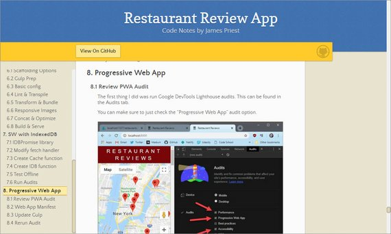](assets/images/code-log-85.jpg) -->

**Progress:** Continued my Udacity React Nanodegree Program.

Today I added React Router to the app and used that rather than relay on state to conditionally display UI.

This has the benefits of:

- Tracking browser/page history
- Ability to use back & forward browser buttons
- URL bar shows URL specific to pages: '/home', '/search', 'detail', etc.
- Ability to bookmark pages

You can read more in my notes: [ReactND Project 1 - My Reads: 3. Routing](https://james-priest.github.io/reactnd-project-myreads/#3-routing)

**Links:**
- Live Demo - [reactnd-project-myreads@2-routing](https://codesandbox.io/s/github/james-priest/reactnd-project-myreads/tree/2-routing/) on CodeSandbox
- Code notes - [ReactND Project 1 - My Reads](https://james-priest.github.io/reactnd-project-myreads/)
- Course notes - [Udacity React Fundamentals](https://james-priest.github.io/udacity-nanodegree-react/course-notes/react-fundamentals.html)
- Link to [Udacity React Nanodegree Program](https://www.udacity.com/course/react-nanodegree--nd019)

---

## 84. React Bookshelf Project Specifications
### Day 84: February 5, 2018 - Tuesday

**Project:** [Udacity React Nanodegree Program](https://www.udacity.com/course/react-nanodegree--nd019)

[](https://james-priest.github.io/reactnd-project-myreads/assets/images/p1.jpg)<br>
**Live Demo:** [reactnd-project-myreads@1-starter-files](https://codesandbox.io/s/github/james-priest/reactnd-project-myreads/tree/1-starter-files/) on CodeSandbox

**Progress:** Continued my Udacity React Nanodegree Program.

This is the first of three projects that I have to complete successfully in order to receive my Nanodegree.

This project is book shelf app that tracks books

- I'm reading
- Want to read
- Have read

It should allow you to search for books, add books, and move them between shelves.

[](https://james-priest.github.io/reactnd-project-myreads/assets/images/p3.jpg)

You can read more in my notes: [ReactND Project 1 - My Reads: 2. Analysis](https://james-priest.github.io/reactnd-project-myreads/#2-analysis)

**Links:**
- Live Demo - [reactnd-project-myreads@1-starter-files](https://codesandbox.io/s/github/james-priest/reactnd-project-myreads/tree/1-starter-files/) on CodeSandbox
- Code notes - [ReactND Project 1 - My Reads](https://james-priest.github.io/reactnd-project-myreads/)
- Course notes - [Udacity React Fundamentals](https://james-priest.github.io/udacity-nanodegree-react/course-notes/react-fundamentals.html)
- Link to [Udacity React Nanodegree Program](https://www.udacity.com/course/react-nanodegree--nd019)

---

## 83. React Contact Form
### Day 83: February 4, 2018 - Monday

**Project:** [Udacity React Nanodegree Program](https://www.udacity.com/course/react-nanodegree--nd019)

[](https://james-priest.github.io/udacity-nanodegree-react/assets/images/rf66.jpg)

**Progress:** Continued my Udacity React Nanodegree Program.

This lesson wrapped up the Create Contact input form and completed the operation by saving the record to the database.

This required the following to work properly.

- Implement `form-serialize` pkg to so I could programmatically serialize the form fields
- Pass serialized form fields to our App component's `createContact` method
- Implement `history.push` within Route component's render prop.

This last part "navigates" the app to our Contact List page.

[](https://james-priest.github.io/udacity-nanodegree-react/assets/images/rf67.jpg)

You can read more in my notes: [Udacity React Fundamentals - 5.6 Finish Contact Form](https://james-priest.github.io/udacity-nanodegree-react/course-notes/react-fundamentals.html#56-finish-contact-form)

**Links:**
- Live Demo - [Edit on CodeSandbox - Contacts App](https://codesandbox.io/s/kjpv2kv2o)
- Course notes - [Udacity React Fundamentals](https://james-priest.github.io/udacity-nanodegree-react/course-notes/react-fundamentals.html)
- Link to [Udacity React Nanodegree Program](https://www.udacity.com/course/react-nanodegree--nd019)

---

## 82. React Router
### Day 82: February 3, 2018 - Sunday

**Project:** [Udacity React Nanodegree Program](https://www.udacity.com/course/react-nanodegree--nd019)

[](https://james-priest.github.io/udacity-nanodegree-react/assets/images/rf59.jpg)

**Progress:** Continued my Udacity React Nanodegree Program.

This lesson got me familiar with four key components of React Router.  These are:

- **BrowserRouter component** - Wraps App and provides a specialized history object
- **Route component** - Matches route on path and renders content on a match
- **Link component** - Provides links for navigation within the app that tie to the history object
- **Redirect component** - Redirects to a specific route

 React Router is great in that it preserves & tracks nav history and allows you to use the browser's back button. It also provides rendering based on the Route defined.

 It basically provides navigation for React Single Page Applications.

You can read more in my notes: [Udacity React Fundamentals - 5.3 The BrowserRouter Component](https://james-priest.github.io/udacity-nanodegree-react/course-notes/react-fundamentals.html#53-the-browserrouter-component)

**Links:**
- Docs - [React Router](https://reacttraining.com/react-router/web/guides/quick-start)
- Live Demo - [Edit on CodeSandbox - Contacts App](https://codesandbox.io/s/kjpv2kv2o)
- Course notes - [Udacity React Fundamentals](https://james-priest.github.io/udacity-nanodegree-react/course-notes/react-fundamentals.html)
- Link to [Udacity React Nanodegree Program](https://www.udacity.com/course/react-nanodegree--nd019)

---

## 81. Debugging React Router
### Day 81: February 2, 2018 - Saturday

**Project:** [Udacity React Nanodegree Program](https://www.udacity.com/course/react-nanodegree--nd019)

[](assets/images/code-log-81.jpg)

**Progress:** Continued my Udacity React Nanodegree Program.

So today was spent Reading React Router docs and debugging something that was right in front of me the whole time.

I was using the `setState` method rather than the `state` property in my comparison. Unfortunately, the editor didn't flag this as an error because it thought I was doing an assignment rather than an equality check.

You can read my notes: [Udacity React Fundamentals - 5. React Router](https://james-priest.github.io/udacity-nanodegree-react/course-notes/react-fundamentals.html#5-react-router)

**Links:**
- Live Demo - [Edit on CodeSandbox - Contacts App](https://codesandbox.io/s/kjpv2kv2o)
- Course notes - [Udacity React Fundamentals](https://james-priest.github.io/udacity-nanodegree-react/course-notes/react-fundamentals.html)
- Link to [Udacity React Nanodegree Program](https://www.udacity.com/course/react-nanodegree--nd019)

---

## 80. Dynamic Render Pages
### Day 80: February 1, 2018 - Friday

**Project:** [Udacity React Nanodegree Program](https://www.udacity.com/course/react-nanodegree--nd019)

[](https://james-priest.github.io/udacity-nanodegree-react/assets/images/rf58.jpg)

**Progress:** Continued my Udacity React Nanodegree Program.

This lesson introduced the concepts behind React Router and had us attempt to mimic this functionality through state.

Many things did not work including back button navigation, & proper state management.

React Router seems to solve for this by providing a framework to manage navigation of React Single Page Applications.

I also implemented a separate Create User page and added navigation buttons to the React Contacts App.

You can read more in my notes: [Udacity React Fundamentals - 5. React Router](https://james-priest.github.io/udacity-nanodegree-react/course-notes/react-fundamentals.html#5-react-router)

**Links:**
- Live Demo - [Edit on CodeSandbox - Contacts App](https://codesandbox.io/s/kjpv2kv2o)
- Course notes - [Udacity React Fundamentals](https://james-priest.github.io/udacity-nanodegree-react/course-notes/react-fundamentals.html)
- Link to [Udacity React Nanodegree Program](https://www.udacity.com/course/react-nanodegree--nd019)

---

## 79. Lifecycle Event Stages
### Day 79: January 31, 2018 - Thursday

**Project:** [Udacity React Nanodegree Program](https://www.udacity.com/course/react-nanodegree--nd019)

[](https://james-priest.github.io/udacity-nanodegree-react/assets/images/rf56.jpg)

**Progress:** Continued my Udacity React Nanodegree Program.

These last two days were spent diving deeper into the various stages that each  lifecycle event occurs at.

Here’s a list of the most common events in the order in which they occur.

- Mounting
  - constructor()
  - render()
  - componentDidMount()
- Updating
  - render()
  - componentDidUpdate()
- Unmounting
  - componentWillUnmount()

You can read more in my notes: [Udacity React Fundamentals - 4.4 Lifecycle Event Stages](https://james-priest.github.io/udacity-nanodegree-react/course-notes/react-fundamentals.html#44-lifecycle-event-stages)

**Links:**
- Course notes - [Udacity React Fundamentals](https://james-priest.github.io/udacity-nanodegree-react/course-notes/react-fundamentals.html)
- Link to [Udacity React Nanodegree Program](https://www.udacity.com/course/react-nanodegree--nd019)

---

## 78. React Lifecycle Events
### Day 78: January 29, 2018 - Tuesday

**Project:** [Udacity React Nanodegree Program](https://www.udacity.com/course/react-nanodegree--nd019)

[](https://james-priest.github.io/udacity-nanodegree-react/assets/images/rf53.jpg)

**Progress:** Continued my Udacity React Nanodegree Program.

Now I've moved onto Lifecycle Events. These are special methods that each component has which allows us to run custom behavior during certain times of the component's lifecycle.

Some of the ones discussed were

- componentDidMount()
- componentWillUnmount
- getDerivedStateFromProps

You can read more in my notes: [Udacity React Fundamentals - 4. Lifecycle Events](https://james-priest.github.io/udacity-nanodegree-react/course-notes/react-fundamentals.html#4-lifecycle-events)

**Links:**
- Live Demo - [Edit on CodeSandbox - Contacts App](https://codesandbox.io/s/kjpv2kv2o)
- Course notes - [Udacity React Fundamentals](https://james-priest.github.io/udacity-nanodegree-react/course-notes/react-fundamentals.html)
- Link to [Udacity React Nanodegree Program](https://www.udacity.com/course/react-nanodegree--nd019)

---

## 77. React Chat App
### Day 77: January 28, 2018 - Monday

**Project:** [Udacity React Nanodegree Program](https://www.udacity.com/course/react-nanodegree--nd019)

[](https://james-priest.github.io/udacity-nanodegree-react/assets/images/rf49.jpg)

**Progress:** Continued my Udacity React Nanodegree Program.

This is the last exercise in the State Management section of my React Fundamentals course.

It started with the basics of a chat application but it was non-functioning and all the code was static and placed in a single component.

I needed to split the app up into functional components and add code to make the app work. This was done through the use of props, state, & handler methods.

I broke the app down along the following lines.

- App (green)
  - ChatWindow (blue)
    - MessageHistory (yellow)
    - MessageInput (red)

[](https://james-priest.github.io/udacity-nanodegree-react/assets/images/rf50.jpg)

You can read more in my notes: [Udacity React Fundamentals - 3.17 Ex 2 - All Together](https://james-priest.github.io/udacity-nanodegree-react/course-notes/react-fundamentals.html#317-ex-2---all-together)

**Links:**
- Live Demo - [Edit on CodeSandbox - Chat App](https://codesandbox.io/s/0q078mlyqv)
- Course notes - [Udacity React Fundamentals](https://james-priest.github.io/udacity-nanodegree-react/course-notes/react-fundamentals.html)
- Link to [Udacity React Nanodegree Program](https://www.udacity.com/course/react-nanodegree--nd019)

---

## 76. React User Game List
### Day 76: January 27, 2018 - Sunday

**Project:** [Udacity React Nanodegree Program](https://www.udacity.com/course/react-nanodegree--nd019)

[](https://james-priest.github.io/udacity-nanodegree-react/assets/images/rf47.jpg)

**Progress:** Continued my Udacity React Nanodegree Program.

Now I'm at the part of the course were we're give a page of requirements and asked to build the app from scratch.

The first thing I did was draw out the UI elements. Then I drew squares around each separate functional area in order to create a component hierarchy.

Here's what I used for the UI above.

- App (blue)
  - UserInput (red)
  - UserList (yellow)
    - User (green)
    - Game Toggle (purple)

This is what the final app looked like

[](https://james-priest.github.io/udacity-nanodegree-react/assets/images/rf48.jpg)

You can read more in my notes: [Udacity React Fundamentals - 3.16 Ex 1 - All Together](https://james-priest.github.io/udacity-nanodegree-react/course-notes/react-fundamentals.html#316-ex-1---all-together)

**Links:**
- Live Demo - [Edit on CodeSandbox - User Game List](https://codesandbox.io/s/1o593kmy7l)
- Course notes - [Udacity React Fundamentals](https://james-priest.github.io/udacity-nanodegree-react/course-notes/react-fundamentals.html)
- Link to [Udacity React Nanodegree Program](https://www.udacity.com/course/react-nanodegree--nd019)

---

## 75. React Shopping List
### Day 75: January 26, 2018 - Saturday

**Project:** [Udacity React Nanodegree Program](https://www.udacity.com/course/react-nanodegree--nd019)

[](https://james-priest.github.io/udacity-nanodegree-react/assets/images/rf44.jpg)

**Progress:** Continued my Udacity React Nanodegree Program.

This exercise had us take a controlled component and split it up to be modularized from one large components to four separate ones.

This took me longer than I thought it would and was trickier than I realized because I had to map out how best to break up the components.

I followed the React docs recommendation of drawing boxes around each logical component

[](https://james-priest.github.io/udacity-nanodegree-react/assets/images/rf46.jpg)

You can read more in my notes: [Udacity React Fundamentals - 3.14 Ex 2 - Controlled Components](https://james-priest.github.io/udacity-nanodegree-react/course-notes/react-fundamentals.html#314-ex-2---controlled-components)

**Links:**
- Live Demo - [Edit on CodeSandbox - Shopping List](https://codesandbox.io/s/422vqv4227)
- Course notes - [Udacity React Fundamentals](https://james-priest.github.io/udacity-nanodegree-react/course-notes/react-fundamentals.html)
- Link to [Udacity React Nanodegree Program](https://www.udacity.com/course/react-nanodegree--nd019)

---

## 74. Controlled Comps Ex 1
### Day 74: January 25, 2018 - Friday

**Project:** [Udacity React Nanodegree Program](https://www.udacity.com/course/react-nanodegree--nd019)

[](https://james-priest.github.io/udacity-nanodegree-react/assets/images/rf43.jpg)

**Progress:** Continued my Udacity React Nanodegree Program.

This exercise had us create a controlled component who's value was updated by component state.

This is handled by the onChange attribute which is set to handleChange method.

```jsx
class App extends Component {
  state = {
    value: ""
  };
  handleChange = e => {
    const value = e.target.value;
    this.setState({
      value
    });
  };
  render() {
    return (
      <div>
        <input
          type="text"
          placeholder="Say Something"
          value={this.state.value}
          onChange={this.handleChange}
        />
        {this.state.value === "" ? (
          <p>This should mirror the text you typed into the input field.</p>
        ) : (
          <p>{this.state.value}</p>
        )}
      </div>
    )
  }
}
```

You can read more in my notes: [Udacity React Fundamentals - 3.13 Ex 1 - Controlled Components](https://james-priest.github.io/udacity-nanodegree-react/course-notes/react-fundamentals.html#313-ex-1---controlled-components)

**Links:**
- Live Demo - [Edit on CodeSandbox - Controlled Components Ex 1](https://codesandbox.io/s/l57r2xzkz9)
- Course notes - [Udacity React Fundamentals](https://james-priest.github.io/udacity-nanodegree-react/course-notes/react-fundamentals.html)
- Link to [Udacity React Nanodegree Program](https://www.udacity.com/course/react-nanodegree--nd019)

---

## 73. Controlled Components
### Day 73: January 24, 2018 - Thursday

**Project:** [Udacity React Nanodegree Program](https://www.udacity.com/course/react-nanodegree--nd019)

[](https://james-priest.github.io/udacity-nanodegree-react/assets/images/rf36.jpg)

**Progress:** Continued my Udacity React Nanodegree Program.

Today's lesson was all about Controlled Components which are form elements who's state is managed by React state rather than the DOM.

I learned how to

- assign state to an input's value
- create a handleChange method to update state when text is entered into the input
- hook the handleChange method up to the input through the onChange event

You can read more in my notes: [Udacity React Fundamentals - 3.12 Controlled Components](https://james-priest.github.io/udacity-nanodegree-react/course-notes/react-fundamentals.html#312-controlled-components)

**Links:**
- Live Demo - [Edit on CodeSandbox - Contacts App](https://codesandbox.io/s/kjpv2kv2o)
- Course notes - [Udacity React Fundamentals](https://james-priest.github.io/udacity-nanodegree-react/course-notes/react-fundamentals.html)
- Link to [Udacity React Nanodegree Program](https://www.udacity.com/course/react-nanodegree--nd019)

---

## 72. React PropTypes
### Day 72: January 23, 2018 - Wednesday

**Project:** [Udacity React Nanodegree Program](https://www.udacity.com/course/react-nanodegree--nd019)

[](https://james-priest.github.io/udacity-nanodegree-react/assets/images/rf33.jpg)

**Progress:** Continued my Udacity React Nanodegree Program.

Today's lesson introduced [PropTypes](https://reactjs.org/docs/typechecking-with-proptypes.html). PropTypes allows you to define the datatype we expect to be passed to the component that PropTypes is defined for.

Here are some of the things you can define with PropTypes

- array, bool, func, number object, string, symbol
- isRequired or optional
- arrayOf and shapeOf for arrays and objects

Here's a sample of what PropTypes defined for a ListContacts component might look like.

```jsx
ListContacts.propTypes = {
  contacts: PropTypes.arrayOf(
    PropTypes.shape({
      id: PropTypes.string.isRequired,
      name: PropTypes.string.isRequired,
      handle: PropTypes.string.isRequired,
      avatarURL: PropTypes.string.isRequired
    })
  ),
  onDeleteContact: PropTypes.func.isRequired
};
```

You can read more in my notes: [Udacity React Fundamentals - 3.11 PropTypes](https://james-priest.github.io/udacity-nanodegree-react/course-notes/react-fundamentals.html#311-proptypes)

**Links:**
- Live Demo - [Edit on CodeSandbox - Contacts App](https://codesandbox.io/s/kjpv2kv2o)
- Course notes - [Udacity React Fundamentals](https://james-priest.github.io/udacity-nanodegree-react/course-notes/react-fundamentals.html)
- Link to [Udacity React Nanodegree Program](https://www.udacity.com/course/react-nanodegree--nd019)

---

## 71. React Mental Math App
### Day 71: January 22, 2018 - Tuesday

**Project:** [Udacity React Nanodegree Program](https://www.udacity.com/course/react-nanodegree--nd019)

[](https://james-priest.github.io/udacity-nanodegree-react/assets/images/rf32.jpg)

**Progress:** Continued my Udacity React Nanodegree Program.

Today's lesson took me 3 days to complete properly. It consisted of building out a simple Mental Math game with **props** and **state**.

I learned about the following

- Lifting state to a parent component
- Passing data and handler functions as props
- Binding 'this' to handler defined in a parent component
- Avoid using .bind() and arrow functions in render() methods

I read a couple great articles by Cory House on the subject.

> #### ⚠️ Avoid arrow functions & .bind() in render() ⚠️
> We generally want to avoid declaring arrow functions or binding in render() for optimal performance.
>
> You can set up [this ESLint rule (jsx-no-bind)](https://github.com/yannickcr/eslint-plugin-react/blob/master/docs/rules/jsx-no-bind.md) to help alert you to this issue.
>
> See Cory House articles on Medium:
>
> - [React Pattern: Extract Child Components to Avoid Binding](https://medium.freecodecamp.org/react-pattern-extract-child-components-to-avoid-binding-e3ad8310725e)
> - [Why Arrow Functions and bind in React's Render are Problematic](https://medium.freecodecamp.org/why-arrow-functions-and-bind-in-reacts-render-are-problematic-f1c08b060e36)

You can read more in my notes: [Udacity React Fundamentals - 3.10 Managing State](https://james-priest.github.io/udacity-nanodegree-react/course-notes/react-fundamentals.html#310-ex---managing-state)

**Links:**
- Live Demo - [Edit on CodeSandbox - Mental Math App](https://codesandbox.io/s/vvx41ykywy)
- Course notes - [Udacity React Fundamentals](https://james-priest.github.io/udacity-nanodegree-react/course-notes/react-fundamentals.html)
- Link to [Udacity React Nanodegree Program](https://www.udacity.com/course/react-nanodegree--nd019)

---

## 70. React - Main Concepts
### Day 70: January 20, 2018 - Sunday

**Project:** [Udacity React Nanodegree Program](https://www.udacity.com/course/react-nanodegree--nd019)

[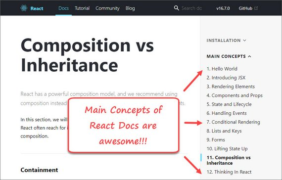](assets/images/code-log-70.jpg)

**Progress:** Continued my Udacity React Nanodegree Program.

Today I spent the day going through [React's Main Concepts documentation](https://reactjs.org/docs/hello-world.html). This consists of 12 sections that build upon each other and that each detail a different fundamental aspect of the React ecosystem.

This was key to my digesting so many of React's key concepts. It serves to fill in any blank spots and gives clear direction on things like:

- Lifting State Up
- Composition of components
- How props and state differ and what should be tracked in each
- How to tackle creating a React UI in 5 steps (Thinking in React)

I love how clear the examples are and that each one links to a CodePen that you can play with.

You can read more in the official [React Docs](https://reactjs.org/docs/hello-world.html)

**Links:**
- Course notes - [Udacity React Fundamentals](https://james-priest.github.io/udacity-nanodegree-react/course-notes/react-fundamentals.html)
- Link to [Udacity React Nanodegree Program](https://www.udacity.com/course/react-nanodegree--nd019)

---

## 69. Update Component State
### Day 69: January 19, 2018 - Saturday

**Project:** [Udacity React Nanodegree Program](https://www.udacity.com/course/react-nanodegree--nd019)

[](https://james-priest.github.io/udacity-nanodegree-react/assets/images/rf29.jpg)

**Progress:** Continued my Udacity React Nanodegree Program.

Today's lesson consisted of updating component state.

State can be set with `setState()` and can either be done by passing in a function.

```jsx
// setState function
this.setState(prevState => ({ // <- implicit return of an object
  count: prevState.count + 1
}))
```

or it can be done by passing in an object

```jsx
// setState object
this.setState({
  username: 'James'
})
```

Once state is updated React knows this and will call render() to re-render the component. This allows for fast, efficient updates to the app's UI.

You can read more in my notes: [Udacity React Fundamentals - 3.9 Updating State](https://james-priest.github.io/udacity-nanodegree-react/course-notes/react-fundamentals.html#39-updating-state)

**Links:**
- Live Demo - [Edit on CodeSandbox - Contacts App](https://codesandbox.io/s/kjpv2kv2o)
- Course notes - [Udacity React Fundamentals](https://james-priest.github.io/udacity-nanodegree-react/course-notes/react-fundamentals.html)
- Link to [Udacity React Nanodegree Program](https://www.udacity.com/course/react-nanodegree--nd019)

---

## 68. Adding Component State
### Day 68: January 18, 2018 - Friday

**Project:** [Udacity React Nanodegree Program](https://www.udacity.com/course/react-nanodegree--nd019)

[](https://james-priest.github.io/udacity-nanodegree-react/assets/images/rf25.jpg)

**Progress:** Continued my Udacity React Nanodegree Program.

Today's lesson consisted of adding state to a component.

Here are some take-aways.

- React `props` represent "read-only" immutable data
- React `state` on the other hand represents mutable data
- React `state` is tied to how the application looks
- An update to state, updates the UI

To add state to our components, all we need to do is add a state property to our class whose value is an object. This object represents the state of our component.

We can either add it as a class field,

```jsx
class User extends React.Component {
  state = {
    username: 'Tyler'
  }
}
```

or we can add it in the constructor

```jsx
class User extends React.Component {
  constructor(props) {
    super(props);
    this.state = {
      username: 'Tyler'
    };
  }
}
```

You can read more in my notes: [Udacity React Fundamentals - 3.8 Add Component State](https://james-priest.github.io/udacity-nanodegree-react/course-notes/react-fundamentals.html#38-add-component-state)

**Links:**
- Course notes - [Udacity React Fundamentals](https://james-priest.github.io/udacity-nanodegree-react/course-notes/react-fundamentals.html)
- Link to [Udacity React Nanodegree Program](https://www.udacity.com/course/react-nanodegree--nd019)

---

## 67. Functional Components
### Day 67: January 17, 2018 - Thursday

**Project:** [Udacity React Nanodegree Program](https://www.udacity.com/course/react-nanodegree--nd019)

[](https://james-priest.github.io/udacity-nanodegree-react/assets/images/rf27.jpg)

**Progress:** Continued my Udacity React Nanodegree Program.

Today's exercises consisted of converting class components to stateless functional components.

Once again, this should be done if our component only has a `render()` method.

Here's the MovieCardList component.

```jsx
const MovieCardsList = props => {
  const { profiles, users, movies } = this.props;
  const usersByMovie = {}; // create empty object

  profiles.forEach(profile => {
    const movieID = profile.favoriteMovieID; // get movieID as key

    if (usersByMovie[movieID]) { // loop thru ea. profile item
      usersByMovie[movieID].push(profile.userID); // push user onto array
    } else { // else if movie key does not exit
      usersByMovie[movieID] = [profile.userID]; // assign user array to key
    }
  });

  const movieCards = Object.keys(movies).map(id => (
    <MovieCard
      key={id}
      users={users}
      usersWhoLikedMovie={usersByMovie[id]}
      movieInfo={movies[id]}
    />
  ));

  return <ul>{movieCards}</ul>;
}
```

Here's the child MovieCard component.

```jsx
const MovieCard = props => {
  const { users, usersWhoLikedMovie, movieInfo } = props;

  return (
    <li key={movieInfo.id}>
      <h2>{movieInfo.name}</h2>
      <h3>Liked By:</h3>

      {!usersWhoLikedMovie || usersWhoLikedMovie.length === 0 ? (
        <p>None of the current users liked this movie.</p>
      ) : (
        <ul>
          {usersWhoLikedMovie &&
            usersWhoLikedMovie.map(userId => {
              return (
                <li key={userId}>
                  <p>{users[userId].name}</p>
                </li>
              );
            })}
        </ul>
      )}
    </li>
  );
}
```

You can read more in my notes: [Udacity React Fundamentals - 3.6 Functional Components](https://james-priest.github.io/udacity-nanodegree-react/course-notes/react-fundamentals.html#36-functional-components)

**Links:**
- Live Demo - [Edit on CodeSandbox - Ex - Functional Component](https://codesandbox.io/s/p3roynm48q)
- Course notes - [Udacity React Fundamentals](https://james-priest.github.io/udacity-nanodegree-react/course-notes/react-fundamentals.html)
- Link to [Udacity React Nanodegree Program](https://www.udacity.com/course/react-nanodegree--nd019)

---

## 66. Stateless Fn Components
### Day 66: January 16, 2018 - Wednesday

**Project:** [Tyler McGinnis React Fundamentals course](https://tylermcginnis.com/courses/react-fundamentals/)

[](https://james-priest.github.io/tm-react-fundamentals/assets/images/26.jpg)

**Progress:** Today I learned about Stateless Functional Components

The lesson focused on refactoring the list portion of the UI shown above from a class component to a functional one.

Here are a few bullet points on using functions in place of classes for components.

- Can be used if our class component only has a `render()` method
- Simpler and reduced syntax
- Takes in props and returns UI
- Doesn't rely on 'this' keyword

One key take-away from the lesson was the statement.

> "If you’re using React correctly, you’re going to notice you have a lot of components that simply take in some data via props and output some UI"

You can read more in my notes: [React Fundamentals - 11.1 Stateless Fn Explained](https://james-priest.github.io/tm-react-fundamentals/react-fundamentals.html#111-stateless-fn-explained)

**Links:**
- GitHub - [Popular React component](https://github.com/james-priest/github-battle/tree/stateless-fn-components)
- Course notes - [React Fundamentals](https://james-priest.github.io/tm-react-fundamentals/react-fundamentals.html)
- Link to [Tyler McGinnis React Fundamentals course](https://tylermcginnis.com/courses/react-fundamentals/)

---

## 65. React Popular Movies
### Day 65: January 15, 2018 - Tuesday

**Project:** [Udacity React Nanodegree Program](https://www.udacity.com/course/react-nanodegree--nd019)

[](https://james-priest.github.io/udacity-nanodegree-react/assets/images/rf23.jpg)

**Progress:** Continued my Udacity React Nanodegree Program.

Today I worked on more React props exercises. This one required the following:

- Splitting the UI over multiple nested components
- Mapping, filtering, and resolving data from objects
- Converting between objects and arrays using `Object.keys()` & `Object.values()`

Here's some sample code.

```jsx
class PopularMovies extends Component {
  render() {
    const { profiles, users, movies } = this.props;
    const moviesArr = Object.values(movies);
    return (
      <div className="PopularMovies-container">
        {moviesArr.map(movie => (
          <div key={movie.id} className="PopularMovies-cell">
            <h3>{movie.name}</h3>
            <UserList movieID={movie.id} users={users} profiles={profiles} />
          </div>
        ))}
      </div>
    );
  }
}
```

You can read more in my notes: [Udacity React Fundamentals - 3.5 Ex 2 - Passing Data](https://james-priest.github.io/udacity-nanodegree-react/course-notes/react-fundamentals.html#35-ex-2---passing-data)

**Links:**
- Live Demo - [Edit on CodeSandbox - Popular Movies](https://codesandbox.io/s/m3mny1540p)
- Course notes - [Udacity React Fundamentals](https://james-priest.github.io/udacity-nanodegree-react/course-notes/react-fundamentals.html)
- Link to [Udacity React Nanodegree Program](https://www.udacity.com/course/react-nanodegree--nd019)

---

## 64. React Favorite Movies
### Day 64: January 14, 2018 - Monday

**Project:** [Udacity React Nanodegree Program](https://www.udacity.com/course/react-nanodegree--nd019)

[](https://james-priest.github.io/udacity-nanodegree-react/assets/images/rf21.jpg)

**Progress:** Continued my Udacity React Nanodegree Program.

Today I worked on a props exercise. It required the following:

- Passing three different data sets with props
- Mapping over one of the data sets to create related elements
- Using the other two data set object stores as lookups for display data

Here's an example of the data used.

```js
const profiles = [
  {
    id: 1,
    userID: '1',
    favoriteMovieID: '1',
  },
  // more records...
];

const users = {
  1: {
    id: 1,
    name: 'Jane Cruz',
    userName: 'coder',
  },
  // more records...
};

const movies = {
  1: {
    id: 1,
    name: 'Planet Earth 1',
  },
  // more records...
};
```

You can read more in my notes: [Udacity React Fundamentals - 3.4 Ex 1 - Passing Data](https://james-priest.github.io/udacity-nanodegree-react/course-notes/react-fundamentals.html#34-ex-1---passing-data)

**Links:**
- Live Demo - [Edit on CodeSandbox - Favorite Movies](https://codesandbox.io/s/42xj4xq7l4)
- Course notes - [Udacity React Fundamentals](https://james-priest.github.io/udacity-nanodegree-react/course-notes/react-fundamentals.html)
- Link to [Udacity React Nanodegree Program](https://www.udacity.com/course/react-nanodegree--nd019)

---

## 63. Passing Data With Props
### Day 63: January 13, 2018 - Sunday

**Project:** [Udacity React Nanodegree Program](https://www.udacity.com/course/react-nanodegree--nd019)

[](https://james-priest.github.io/udacity-nanodegree-react/assets/images/rf20.jpg)

**Progress:** Continued my Udacity React Nanodegree Program.

Today lesson covered the following

- Passing data with props
- Mapping over an array to create elements
- Creating Inline styles specific to each record

You can read more in my notes: [Udacity React Fundamentals - 3.2 Passing Data with Props](https://james-priest.github.io/udacity-nanodegree-react/course-notes/react-fundamentals.html#32-pass-data-with-props)

**Links:**
- Live Demo - [Edit on CodeSandbox - Contacts App](https://codesandbox.io/s/qk7olqz52j)
- Course notes - [Udacity React Fundamentals](https://james-priest.github.io/udacity-nanodegree-react/course-notes/react-fundamentals.html)
- Link to [Udacity React Nanodegree Program](https://www.udacity.com/course/react-nanodegree--nd019)

---

## 62. Simple Composition
### Day 62: January 12, 2018 - Saturday

**Project:** [Udacity React Nanodegree Program](https://www.udacity.com/course/react-nanodegree--nd019)

[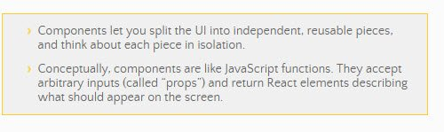](assets/images/code-log-62.jpg)

**Progress:** Continued my Udacity React Nanodegree Program.

Today lesson covered the following

- Installing & using Create React App for a quick, no-config build environment
- Composing elements together within components
- Composing components together to form a UI or View

You can read more in my notes: [Udacity React Fundamentals - 2.3 Create React App](https://james-priest.github.io/udacity-nanodegree-react/course-notes/react-fundamentals.html#23-create-react-app)

**Links:**
- CodeSandbox - [Simple Composition - Contacts](https://codesandbox.io/s/p98n45z1wq)
- Course notes - [Udacity React Fundamentals](https://james-priest.github.io/udacity-nanodegree-react/course-notes/react-fundamentals.html)
- Link to [Udacity React Nanodegree Program](https://www.udacity.com/course/react-nanodegree--nd019)

---

## 61. CodeSandbox & React
### Day 61: January 11, 2018 - Friday

**Project:** [Udacity React Nanodegree Program](https://www.udacity.com/course/react-nanodegree--nd019)

[](https://james-priest.github.io/udacity-nanodegree-react/assets/images/rf8.jpg)

**Progress:** Continued my Udacity React Nanodegree Program.

Today I used [CodeSandbox](https://codesandbox.io) to quickly spin up React dev environments for testing out various React concepts.

I LOVE this app. It is super easy to use. Includes ESLint, Prettier, great UI. Also has a beautiful editor with clean Color Themes and awesome monospace font (Dank Mono).

I used it to work on the following lesson exercises.

- React & ReactDOM libraries
- React.createElement
- Nested elements
- List data
- JSX
- Component Intro

You can read more in my notes: [Udacity React Fundamentals - 2.1 Rendering UI Intro](https://james-priest.github.io/udacity-nanodegree-react/course-notes/react-fundamentals.html#21-rendering-ui-intro)

**Links:**
- Blog Post - [Currying and ES6 Arrow Functions](http://codekirei.com/posts/currying-with-arrow-functions/)
- Course notes - [Udacity React Fundamentals](https://james-priest.github.io/udacity-nanodegree-react/course-notes/react-fundamentals.html)
- Link to [Udacity React Nanodegree Program](https://www.udacity.com/course/react-nanodegree--nd019)

---

## 60. React Higher-Order Functions
### Day 60: January 10, 2018 - Thursday

**Project:** [Udacity React Nanodegree Program](https://www.udacity.com/course/react-nanodegree--nd019)

[](https://james-priest.github.io/udacity-nanodegree-react/assets/images/rf3.jpg)

**Progress:** Continued my Udacity React Nanodegree Program.

Today's lesson discussed

- Unidirectional data flow in React (vs bi-directional for Angular & Ember)
- JavaScript higher-order functions such as map, filter, & reduce
- ES6 syntax - destructuring, spread, and rest operators

Then the lesson started skirting the realm of Functional Programming with concepts of **currying** and **functional composition**

I was kind of blown away by the following code sample...

```js
const shelf1 = [{name: 'book1', shelf: 'a'},{name: 'book2', shelf: 'a'}];
const shelf2 = [{name: 'book3', shelf: 'b'},{name: 'book4', shelf: 'b'}];
const allBooks = [...shelf1, ...shelf2];

const filter = books => shelf => books.filter(b => {
  return b.shelf === shelf;
});

// currying.. produces array with 2 objects: book3 & book4
const shelf = filter(allBooks)('b'); // (2) [{...}, {...}]

console.log(shelf); // (2) [{...}, {...}]
```

Notice the use of double arrow functions in the `filter` function expression we created.

```js
const filterBy = filter(allBooks); // partial function
const booksOnShelf = filterBy('b');

console.log(booksOnShelf) // (2) [{...}, {...}]
```

Here we see the use of **currying** and **partial functions**. We also see the use of double arrow functions on the same line. The Blog Post [Currying and ES6 Arrow Functions](http://codekirei.com/posts/currying-with-arrow-functions/) does a great job of explaining this sorcery.

You can read more in my notes: [Udacity React Fundamentals - 1.5 React is Just javaScript](https://james-priest.github.io/udacity-nanodegree-react/course-notes/react-fundamentals.html#15-react-is-just-javascript)

**Links:**
- Blog Post - [Currying and ES6 Arrow Functions](http://codekirei.com/posts/currying-with-arrow-functions/)
- Course notes - [Udacity React Fundamentals](https://james-priest.github.io/udacity-nanodegree-react/course-notes/react-fundamentals.html)
- Link to [Udacity React Nanodegree Program](https://www.udacity.com/course/react-nanodegree--nd019)

---

## 59. Why React
### Day 59: January 9, 2018 - Wednesday

**Project:** [Udacity React Nanodegree Program](https://www.udacity.com/course/react-nanodegree--nd019)

[](https://james-priest.github.io/udacity-nanodegree-react/assets/images/rf1.jpg)

**Progress:** I started my Udacity React Nanodegree Program today.

This first lesson covered to following.

- Why React?
- What is Composition
- Declarative vs. Imperative code

You can read more in my notes: [Udacity React Fundamentals - 1. Why React](https://james-priest.github.io/udacity-nanodegree-react/course-notes/react-fundamentals.html#1-why-react)

**Links:**
- Course notes - [Udacity React Fundamentals](https://james-priest.github.io/udacity-nanodegree-react/course-notes/react-fundamentals.html)
- Link to [Udacity React Nanodegree Program](https://www.udacity.com/course/react-nanodegree--nd019)

---

## 58. Component State
### Day 58: January 8, 2018 - Tuesday

**Project:** [Tyler McGinnis React Fundamentals course](https://tylermcginnis.com/courses/react-fundamentals/)

[](https://james-priest.github.io/tm-react-fundamentals/assets/images/22.jpg)

**Progress:** Today I documented everything that went into creating state for a component.

This includes:

- Updating the App structure to use require & module exports (CommonJS)
- Building the component
- Adding default state in the class constructor
- Creating a function to update state
- Hooking up the click handler
- Using `.bind` to make sure `this` is in the right context
- Applying style based on state

You can read more in my notes: [React Fundamentals - 10. Component State](https://james-priest.github.io/tm-react-fundamentals/react-fundamentals.html#10-component-state)

**Links:**
- GitHub - [Popular React component](https://github.com/james-priest/github-battle/tree/popular/app/components)
- GitHub - [My React Code samples](https://github.com/james-priest/github-battle/tree/first-components/app)
- GitHub - [React Starter App](https://github.com/james-priest/react-starter-app)
- Course notes - [React Fundamentals](https://james-priest.github.io/tm-react-fundamentals/react-fundamentals.html)
- Link to [Tyler McGinnis React Fundamentals course](https://tylermcginnis.com/courses/react-fundamentals/)

---

## 57. React State
### Day 57: January 7, 2018 - Monday

**Project:** [Tyler McGinnis React Fundamentals course](https://tylermcginnis.com/courses/react-fundamentals/)

[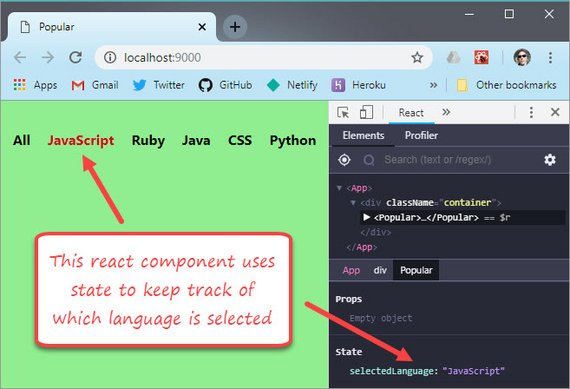](assets/images/code-log-57.jpg)

**Progress:** Today I build my first component that used State.

The previous day was spent on JavaScript's `this` keyword along with `.call()`, `.apply()` and `.bind()` function methods.

This was a necessary precursor to understanding how to manage state and set the context of the `this` keyword.

The component I built was a simple clickable list that kept track of which item was clicked.  This will be part of a larger UI that displays detail information based on the selected language.

You can read more here: [React Fundamentals - 9. The 'this' keyword](https://james-priest.github.io/tm-react-fundamentals/react-fundamentals.html#9-the-this-keyword)

**Links:**
- GitHub - [Popular React component](https://github.com/james-priest/github-battle/tree/popular/app/components)
- GitHub - [My React Code samples](https://github.com/james-priest/github-battle/tree/first-components/app)
- GitHub - [React Starter App](https://github.com/james-priest/react-starter-app)
- Course notes - [React Fundamentals](https://james-priest.github.io/tm-react-fundamentals/react-fundamentals.html)
- Link to [Tyler McGinnis React Fundamentals course](https://tylermcginnis.com/courses/react-fundamentals/)

---

## 56. 4 Types of Binding 'this'
### Day 56: January 6, 2018 - Sunday

**Project:** [Tyler McGinnis React Fundamentals course](https://tylermcginnis.com/courses/react-fundamentals/)

```js
// Implicit Binding
// Left of the Dot at Call Time
var me = {
  name: 'James',
  age: 48,
  sayName: function() {
    console.log(this.name);
  }
};

me.sayName(); // James
```

**Progress:** Today I reviewed the `this` keyword in depth.

`this` is one of the most misunderstood aspects of JavaScript because it's context changes based on how the function or method containing `this` is invoked.

I learned there are 4 types of binding for `this` keyword.

- **Implicit Binding** - based on context/object used to call the function
- **Explicit Binding** - **.call()**, **.apply()**, or **.bind()** used to invoke the function
- **new Binding** - invoked with a **new** keyword and set to the newly created object
- **window Binding** - bound to the **window** object if the function is not called using any of the previous three options

The lesson goes into depth regarding what specifically is happening in each of the cases above and gives code examples.

You can read more here: [React Fundamentals - 9. The 'this' keyword](https://james-priest.github.io/tm-react-fundamentals/react-fundamentals.html#9-the-this-keyword)

**Links:**
- GitHub - [My React Code samples](https://github.com/james-priest/github-battle/tree/first-components/app)
- GitHub - [React Starter App](https://github.com/james-priest/react-starter-app)
- Course notes - [React Fundamentals](https://james-priest.github.io/tm-react-fundamentals/react-fundamentals.html)
- Link to [Tyler McGinnis React Fundamentals course](https://tylermcginnis.com/courses/react-fundamentals/)

---

## 55. React Composition & PropTypes
### Day 55: January 5, 2018 - Saturday

**Project:** [Tyler McGinnis React Fundamentals course](https://tylermcginnis.com/courses/react-fundamentals/)

[](https://james-priest.github.io/tm-react-fundamentals/assets/images/18.jpg)

**Progress:** Today I learned about the following:

- Functional composition
- Stateless Functional Components
- Pure functions
- Type checking with PropTypes

Here's an example of components written as functions.

```jsx
const ProfilePic = function(props) {
  const { username } = props;
  return ;
};

const ProfileLink = function(props) {
  const { username } = props;
  return <a href={`https://www.fb.com/${username}`}>{username}</a>;
};

const Avatar = function(props) {
  const { username } = props;
  return (
    <div>
      <h3>Stateless Functional Components</h3>
      <ProfilePic username={username} />
      <ProfileLink username={username} />
    </div>
  );
};
<Avatar username="james-priest" />
```

Here's an example of PropTypes being defined.

```jsx
Users.propTypes = {
  list: PropTypes.arrayOf(PropTypes.string).isRequired
};

ReactDOM.render(
  <Users list={['Tyler', 'Mikenzi', 'Ryan', 'Michael', 23]} />,
  document.getElementById('app')
);
```

You can read more here: [React Fundamentals - 8.1 Functional Composition](https://james-priest.github.io/tm-react-fundamentals/react-fundamentals.html#81-functional-composition)

**Links:**
- GitHub - [My React Code samples](https://github.com/james-priest/github-battle/tree/first-components/app)
- GitHub - [React Starter App](https://github.com/james-priest/react-starter-app)
- Course notes - [React Fundamentals](https://james-priest.github.io/tm-react-fundamentals/react-fundamentals.html)
- Link to [Tyler McGinnis React Fundamentals course](https://tylermcginnis.com/courses/react-fundamentals/)

---

## 54. React List map & filter
### Day 54: January 4, 2018 - Friday

**Project:** [Tyler McGinnis React Fundamentals course](https://tylermcginnis.com/courses/react-fundamentals/)

[](https://james-priest.github.io/tm-react-fundamentals/assets/images/16.jpg)

**Progress:** Today I worked with lists using `.map` & `.filter`.

- Map allows us to cycle through an array and output each value to the UI
- Filter allows us to return array elements that match a certain condition

Here's a basic mapping example that uses a parent and child component.

```jsx
class FriendsContainer extends React.Component {
  render() {
    const name = 'James Priest';
    const friends = ['Evi', 'Joeylene', 'Brittany', 'Anusha', 'Divya'];
    const containerStyle = {
      border: '1px solid blue',
      padding: '10px'
    };
    return (
      <div style={containerStyle}>
        <h3>Name : {name}</h3>
        <ShowList names={friends} />
      </div>
    );
  }
}

class ShowList extends React.Component {
  render() {
    const { names } = this.props;
    const listStyle = {
      border: '1px solid red',
      padding: '10px'
    };
    return (
      <div style={listStyle}>
        <h3>Twitter Friends</h3>
        <ul>
          {names.map(friend => (
            <li key={friend}>{friend}</li>
          ))}
        </ul>
      </div>
    );
  }
}

ReactDOM.render(<FriendsContainer />, document.getElementById('app'));
```

To see more advanced examples including the use of filter you can check my notes.

You can read more here: [React Fundamentals - 7.3 Lists with map & filter](https://james-priest.github.io/tm-react-fundamentals/react-fundamentals.html#73-lists-with-map--filter)

**Links:**
- GitHub - [My React Code samples](https://github.com/james-priest/github-battle/tree/first-components/app)
- GitHub - [React Starter App](https://github.com/james-priest/react-starter-app)
- Course notes - [React Fundamentals](https://james-priest.github.io/tm-react-fundamentals/react-fundamentals.html)
- Link to [Tyler McGinnis React Fundamentals course](https://tylermcginnis.com/courses/react-fundamentals/)

---

## 53. React Props & State
### Day 53: January 3, 2018 - Thursday

**Project:** [Tyler McGinnis React Fundamentals course](https://tylermcginnis.com/courses/react-fundamentals/)

[](https://james-priest.github.io/tm-react-fundamentals/assets/images/13.jpg)

**Progress:** Learned about props today.

Here are some specifics

- React is very good at managing state
- The system for passing data from one component to a child component is through props
- Props are to component what arguments are to functions

Here's a basic way of coding the component above.

```jsx
const React = require('react');
const ReactDOM = require('react-dom');

class Badge extends React.Component {
  render() {
    return (
      <div>
        <h1>Badge 1</h1>
        
        <h2>Name: {this.props.name}</h2>
        <h3>Username: {this.props.username}</h3>
      </div>
    );
  }
}

ReactDOM.render(
  <Badge
    name="James Priest"
    username="james-priest"
    img="https://avatars1.githubusercontent.com/u/27903822?s=460&v=4"
  />,
  document.getElementById('app')
);
```

To see more advanced examples of props using ES6 destructuring see course notes.

You can read more here: [React Fundamentals - 7. Dataflow with Props](https://james-priest.github.io/tm-react-fundamentals/react-fundamentals.html#7-dataflow-with-props)

**Links:**
- GitHub - [React Starter App](https://github.com/james-priest/react-starter-app)
- Course notes - [React Fundamentals](https://james-priest.github.io/tm-react-fundamentals/react-fundamentals.html)
- Link to [Tyler McGinnis React Fundamentals course](https://tylermcginnis.com/courses/react-fundamentals/)

---

## 52. React Nanodegree
### Day 52: January 2, 2018 - Wednesday

**Project:** Udacity React Nanodegree

[](assets/images/code-log-52.jpg)

**Progress:** I signed up for Udacity's React Nanodegree program today.

I had such a good experience with the Mobile Web Specialist Nanodegree program that I figured I'd use Udacity to get my React training as well.

This is a four months program that will cover the following:

- React
- Redux
- React Native

We will also be required to build a separate project using each of the three technologies in order to receive our certification and complete the program.

**Links:**
- Link to [Udacity React Nanodegree](https://www.udacity.com/course/react-nanodegree--nd019)

---

## 51. ESLint, Airbnb, & Prettier
### Day 51: December 31, 2018 - Monday

**Project:** Configure linting & code formatting in VS Code for React development.

[](https://james-priest.github.io/tm-react-fundamentals/assets/images/12.jpg)

**Progress:** I spent the last 8 days experimenting with every kind of linting and code formatting configuration I could find for React development within VSCode.

I knew I wanted the following:

- Error highlighting
- Emphasis of best coding practices
- Nicely formatted code

I found that in the following:

- **ESLint** for linting, **Airbnb** for coding style, and **Prettier** for code formatting.

 So far, so good. The real craziness started with trying to determine which packages, plugins, & configurations I should be using.

In all, I tried about 20 different package combinations before getting everything to work properly.

Here are a couple things I learned.

**Prettier & ESLint explained**

- **Prettier** ([https://prettier.io](https://prettier.io/docs/en/index.html)) formats your code and nothing more. It's opinionated and therefore only has a few configurable formatting rules (single or double quotes, semi colon, etc.). It will reformat your code but does not help with code quality.
- **ESLint** ([https://eslint.org](https://eslint.org/docs/user-guide/getting-started)) handles both code quality AND code formatting (depending on which rules or Style Guide you use). If you use Prettier then you should turn off ESLint's code formatting rules. There are packages to do this automatically.
- **Airbnb** ([https://github.com/airbnb/javascript](https://github.com/airbnb/javascript)) Provides a set of code style rules from which to work. This covers possible errors, best practices, and stylistic choices.

You can read more in my notes: [React Fundamentals - 6. ESLint, Airbnb, & Prettier](https://james-priest.github.io/tm-react-fundamentals/react-fundamentals.html#6-eslint-airbnb--prettier)

**Links:**
- GitHub - [React Starter App](https://github.com/james-priest/react-starter-app)
- Course notes - [React Fundamentals](https://james-priest.github.io/tm-react-fundamentals/react-fundamentals.html)
- Link to [Tyler McGinnis React Fundamentals course](https://tylermcginnis.com/courses/react-fundamentals/)

---

## 50. First React Component
### Day 50: December 25, 2018 - Tuesday

**Project:** [Tyler McGinnis React Fundamentals course](https://tylermcginnis.com/courses/react-fundamentals/)

```jsx
var React = require('react');
var ReactDOM = require('react-dom');
class HelloWorld extends React.Component {
  render() {
    return (
      <div>Hello React!</div>
    )
  }
}
ReactDOM.render(<HelloWorld />, document.getElementById('app'));
```

**Progress:** This part of the course began deconstructing the aspects of a React component. It also contrasted that with a React element.

Learned about

- React & ReactDOM modules
- ES6 Classes
- JSX
- render method

[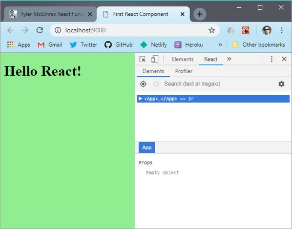](assets/images/code-log-50.jpg)

You can read more in my notes: [React Fundamentals - 5. First React Component](https://james-priest.github.io/tm-react-fundamentals/react-fundamentals.html#5-first-react-component)

**Links:**
- Course notes - [React Fundamentals](https://james-priest.github.io/tm-react-fundamentals/react-fundamentals.html)
- Link to [Tyler McGinnis React Fundamentals course](https://tylermcginnis.com/courses/react-fundamentals/)

---

## 49. React Webpack Config
### Day 49: December 24, 2018 - Monday

**Project:** [Tyler McGinnis React Fundamentals course](https://tylermcginnis.com/courses/react-fundamentals/)

<!-- [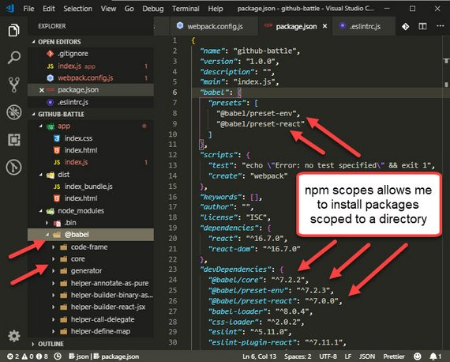](assets/images/code-log-48.jpg) -->

```js
// In webpack.config.js
module.exports = {
  entry: './app/index.js',
  module: {
    rules: [
      { test: /\.(js)$/, use: 'babel-loader' },
      { test: /\.css$/, use: { 'style-loader', 'css-loader' }}
    ]
  },
  output: {
    path: path.resolve(__dirname, 'dist'),
    filename: 'index_bundle.js'
  },
  plugins: [
    new HtmlWebpackPlugin({
      template: 'app/index.html'
    })
  ],
  mode: "development"
}
```

**Progress:** The next step in this course was learning how to configure Webpack.

> Webpack, at its core, is a code bundler. It takes your code, transforms and bundles it, then returns a new version of your code.

I learned about

- Setting an entry point
- Using loaders for transformations
- Setting the output directory
- Specifying an HTML template
- Using webpack-dev-server

You can read more in my notes: [React Fundamentals - 4. React Setup](https://james-priest.github.io/tm-react-fundamentals/react-fundamentals.html#4-react-setup)

**Links:**
- Course notes - [React Fundamentals](https://james-priest.github.io/tm-react-fundamentals/react-fundamentals.html)
- Link to [Tyler McGinnis React Fundamentals course](https://tylermcginnis.com/courses/react-fundamentals/)

---

## 48. Npm Scopes
### Day 48: December 23, 2018 - Sunday

**Project:** [Tyler McGinnis React Fundamentals course](https://tylermcginnis.com/courses/react-fundamentals/)

[](assets/images/code-log-48.jpg)

**Progress:** Learned something new about npm!

#### Old way

Previously, I was installing all my babel packages without using `@babel` scope.  This means my installs looked like this.

```bash
npm install --save-dev babel-core babel-preset-env babel-preset-react
```

It would then place these three related packages in the root of `node_modules` directory.

#### New way
Now I see I can install related packages to the same scoped directory provided the scoped packages exist.

The same install would look like this.

```bash
npm install --save-dev @babel/core @babel/preset-env @babel/preset-react
```

Here's the directory structures

```text
OLD DIRECTORY STRUCTURE         NEW DIRECTORY STRUCTURE
/node_modules                   / node_modules
  - babel-core                    - @babel
  - babel-preset-env                - core
  - babel-preset-react              - preset-env
                                    - preset-react
```

This is a lot cleaner and allows me to keep related packages together.

**Links:**
- Course notes - [React Fundamentals](https://james-priest.github.io/tm-react-fundamentals/react-fundamentals.html)
- Link to [Tyler McGinnis React Fundamentals course](https://tylermcginnis.com/courses/react-fundamentals/)

---

## 47. React Fundamentals
### Day 47: December 22, 2018 - Saturday

**Project:** [Tyler McGinnis React Fundamentals course](https://tylermcginnis.com/courses/react-fundamentals/)

[](https://james-priest.github.io/tm-react-fundamentals/assets/images/10.jpg)

**Progress:** Just started Tyler's React Fundamentals course.

I haven't done any coding yet but I love that he takes the time to set the stage and give some necessary context to what React is all about.

He started by explaining some of the features of React.

- Uses Composition
- Declarative
- Unidirectional data flow
- Explicit mutations
- Just JavaScript

He then breaks down the React ecosystem and explains the following:

- React
- React Router
- Webpack
- Babel
- Axios

Lastly, he covered additional examples of imperative vs declarative code and the benefits of declarative.

See my notes [React Fundamentals 1. Why React](https://james-priest.github.io/tm-react-fundamentals/react-fundamentals.html) to get a better sense of the material covered including:

- Why React
- The React Ecosystem
- Imperative vs. Declarative

**Links:**
- Course notes - [React Fundamentals](https://james-priest.github.io/tm-react-fundamentals/react-fundamentals.html)
- Link to [Tyler McGinnis React Fundamentals course](https://tylermcginnis.com/courses/react-fundamentals/)

---

## 46. Roman Numeral Convert
### Day 46: December 21, 2018 - Friday

**Project:** freeCodeCamp JavaScript Algorithms and Data Structures Certification

[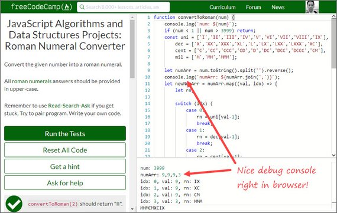](assets/images/code-log-46.jpg)

**Progress:** Redoing some JavaScript Algo's

Now that I have my cert, I'm going back to see where I can refactor and update code. This was a Roman Numeral Converter that required some array manipulation.

I used `.map`, `.split`, `.reverse`, & `.join`. This one was fun bc it challenged without being too difficult.

[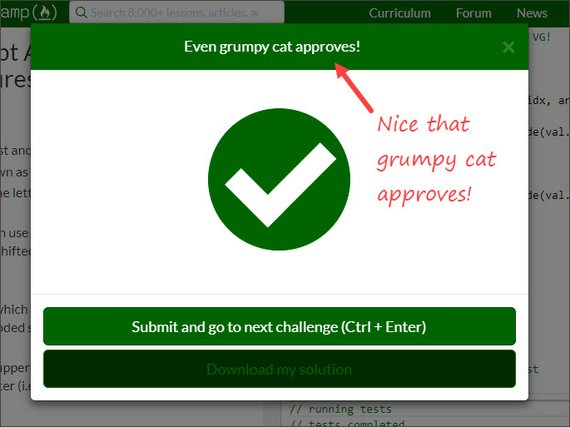](assets/images/code-log-46a.jpg)

**Links:**
- [freeCodeCamp](https://www.freecodecamp.com)
- View my FCC [JavaScript Algorithms](https://github.com/james-priest/code-exercises/tree/master/javascript_exercises/fcc/js-algorithms) Solutions on GitHub

---

## 45. JavaScript Algorithms and Data Structures Certification
### Day 45: December 19, 2018 - Wednesday

**Project:** freeCodeCamp JavaScript Algorithms and Data Structures Certification

[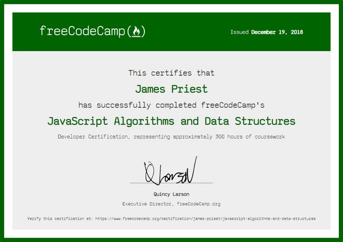](assets/images/code-log-45.jpg)

**Progress:** Last project completed!

This is the second [freeCodeCamp](https://www.freecodecamp.com) certification that I had started in 2017 but had to put on hold because of my Udacity Nanodegree scholarship.

I finished the last of the final projects today!

This cert actually represents approximately 300 hours of coursework but I still have yet to complete the exercises for each of the sections.

Now that I have the cert, I'm going back to do  each of the exercises before attempting the final projects once again. This will show me anything new I've learned and will give me a chance to refactor and tighten up my code.

**Links:**
- freeCodeCamp - View [JavaScript Algorithms and Data Structures Certification](https://www.freecodecamp.org/certification/james-priest/javascript-algorithms-and-data-structures)

---

## 44. Responsive Web Design Certification
### Day 44: December 17, 2018 - Monday

**Project:** freeCodeCamp Responsive Web Design Certification

[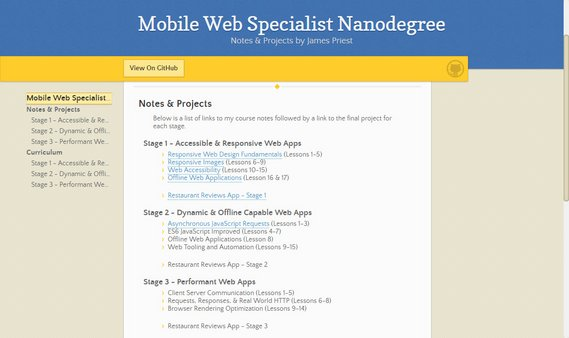](assets/images/code-log-44.jpg)

**Progress:** Last project completed!

This cert represents approximately 300 hours of coursework.

I actually had done most of it in 2017 but had to put it on hold due to my Udacity Nanodegree scholarship. I've now just gotten back around to finishing the final requirements & assignments.

**Links:**
- freeCodeCamp - View [Responsive Web Design Certification](https://www.freecodecamp.org/certification/james-priest/responsive-web-design)

---

## 43. Technical Documentation
### Day 43: December 16, 2018 - Sunday

**Project:** freeCodeCamp Responsive Web Design Certification

[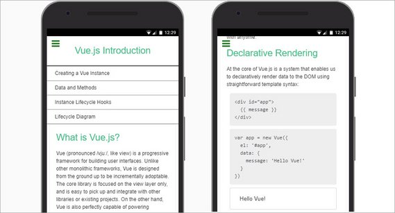](assets/images/code-log-43.jpg)<br>
**CodePen:** [Technical Documentation Page](https://codepen.io/james-priest/pen/QzNeZr?editors=0100)

**Progress:** Last project completed!

This is the fifth of five projects required for FCC's Responsive Design Certification.

The Technical Documentation page has 13 content (HTML) & 3 layout (CSS) tests it must pass in order to be accepted. These include:

- Use of proper Landmark elements (`<header>`, `<footer>`, `<nav>`, `<main>`, etc.)
- Fixed headers
- Flexbox Layout
- Media queries
- Responsive design

This documentation text was taken from the Vue.js website.

[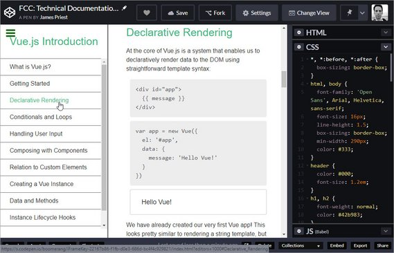](assets/images/code-log-43a.jpg)

**Links:**
- CodePen - [Technical Documentation Page](https://codepen.io/james-priest/pen/QzNeZr?editors=0100)
- CodePen - [Product Landing Page](https://codepen.io/james-priest/pen/WLwJvO?editors=1100)
- CodePen - [Responsive Survey Form](https://codepen.io/james-priest/pen/vvGpBY?editors=1100)
- CodePen - [Personal Portfolio WebPage](https://codepen.io/james-priest/pen/prpjEK)
- CodePen - [Tribute Page](https://codepen.io/james-priest/full/MvEdOV/)

---

## 42. Product Landing Page
### Day 42: December 15, 2018 - Saturday

**Project:** freeCodeCamp Responsive Web Design Certification

[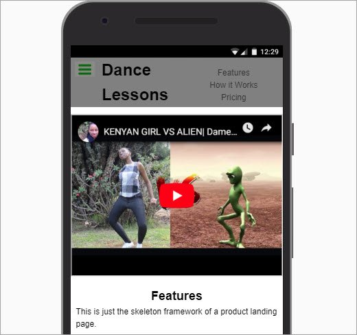](assets/images/code-log-42.jpg)<br>
**CodePen:** [Product Landing Page](https://codepen.io/james-priest/pen/WLwJvO?editors=1100)

**Progress:** Another project completed!

This is the fourth project out of five required necessary for FCC's Responsive Design Certification.

The Product Landing page has 13 content (HTML) & 3 layout (CSS) tests it must pass in order to be accepted. These include:

- Use of proper Landmark elements (`<header>`, `<footer>`, `<nav>`, `<main>`, etc.)
- Embedded video
- `<form>` & `<input>` elements
- HTML5 validation
- Fixed header
- CSS Flexbox Layout
- Media queries

The page is really nothing more than a skeleton framework for a product landing page. It's still pretty rough and not fully flushed out but it serves to meet the baseline requirements.

[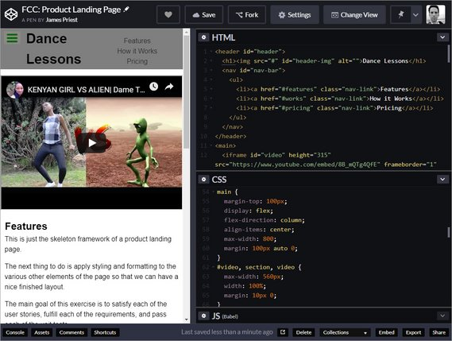](assets/images/code-log-42a.jpg)

**Links:**
- CodePen - [Product Landing Page](https://codepen.io/james-priest/pen/WLwJvO?editors=1100)
- CodePen - [Responsive Survey Form](https://codepen.io/james-priest/pen/vvGpBY?editors=1100)
- CodePen - [Personal Portfolio WebPage](https://codepen.io/james-priest/pen/prpjEK)
- CodePen - [Tribute Page](https://codepen.io/james-priest/full/MvEdOV/)

---

## 41. Responsive Survey Form
### Day 41: December 14, 2018 - Friday

**Project:** freeCodeCamp Responsive Web Design Certification

[](assets/images/code-log-41.jpg)<br>
**CodePen:** [Responsive Survey Form](https://codepen.io/james-priest/pen/vvGpBY?editors=1100)

**Progress:** Another project completed!

This is the third project I've completed out of five required projects necessary for FCC's Responsive Design Certification.

So far I've done the following

- [Tribute Page](https://codepen.io/james-priest/full/MvEdOV/)
- [Personal Portfolio WebPage](https://codepen.io/james-priest/pen/prpjEK)
- [Responsive Survey Form](https://codepen.io/james-priest/pen/vvGpBY?editors=1100)

The survey form uses the following HTML5 & CSS features.

- New HTML5 input types
- HTML5 input validation
- Flexbox Layout

[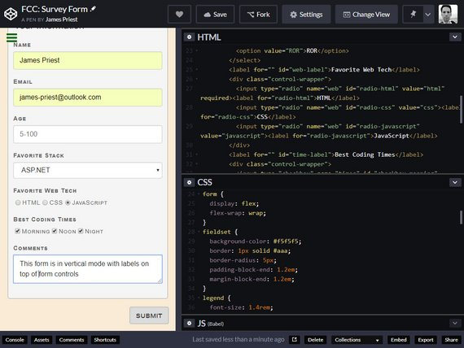](assets/images/code-log-41a.jpg)

**Links:**
- CodePen - [Responsive Survey Form](https://codepen.io/james-priest/pen/vvGpBY?editors=1100)

---

## 40. Restaurant App is Live
### Day 40: December 11, 2018 - Tuesday

**Project:** Host Restaurant Review app

[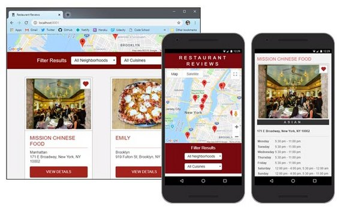](assets/images/restaurant_app.jpg)<br>
**Live Demo:** [Restaurant Review App](https://restaurant-review-app.netlify.com)

**Progress:** Restaurant Review PWA migration is complete!

This app was my capstone project for Udacity's Mobile Web Dev Nanodegree.

The project required that we code against various HTML5 APIs with vanilla Javascript. We were not to use the assistance of any frameworks or external libraries except for a Promise library that wrapped the IndexedDB API.

Here's a high level list of some of the functionality this app needed to produce.

- Asynchronous requests (Ajax)
- Offline-first capability
- Fully Responsive Design
- ARIA compliant, Accessible, and Screen Reader/Assistive Technology capable
- Highly optimized & performant (90+ Audit metrics for Performance, Accessibility, Best Practices, PWA)

Here's a partial list of the APIs and technologies we needed use and demonstrate.

- Service Worker
- Cache API
- JavaScript Promises
- ES 2015 Syntax (arrow functions, destructuring, sting literals, sets, etc.)
- Fetch API
- Web Workers
- Build systems (Grunt, Gulp, BrowserSync, Babel, etc.)
- Progressive Web App features (Service Worker, App Manifest, caching, etc.)

[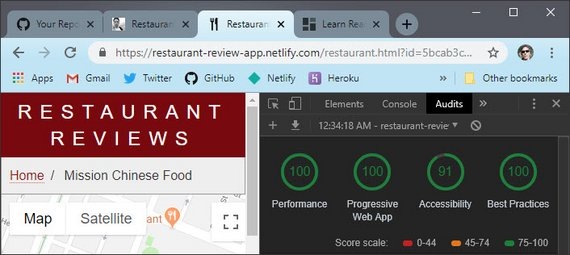](assets/images/code-log-40.jpg)

**Links:**
- Live Demo - [Restaurant Review App](https://restaurant-review-app.netlify.com)
- My Project Notes - [Restaurant Review App - Stage 4](https://james-priest.github.io/mws-restaurant-stage-1/stage4.html)
- GitHub Repo - [MWS Restaurant Stage 1](https://github.com/james-priest/mws-restaurant-stage-1) - Client App
- Udacity’s [Mobile Web Specialist Nanodegree Program](https://www.udacity.com/course/mobile-web-specialist-nanodegree--nd024) by Google (6 month course)

---

## 39. Netlify Build & Deploy
### Day 39: December 10, 2018 - Monday

**Project:** Host Restaurant Review app

[](https://james-priest.github.io/mws-restaurant-stage-1/assets/images/4-48.jpg)

**Progress:** Restaurant Review PWA migration

I learned how to build and deploy a website to Netlify using Continuous Deployment.

I had to do the following

- Setup a new site and point it to my GitHub Repo
- Update my npm packages for security vulnerabilities
- Create a `.env` file for my API keys
- Setup build environment variables on Netlify
- Install `dotenv` npm package
- Update my gulp build file to utilize `process.env.<var>` syntax

You can read more here: [Restaurant Review App - Stage 4: Section 13. Deploy to Netlify](https://james-priest.github.io/mws-restaurant-stage-1/stage4.html#12-uiux-updates).

**Links:**
- My Project Notes - [Restaurant Review App - Stage 4](https://james-priest.github.io/mws-restaurant-stage-1/stage4.html)
- GitHub Repo - [MWS Restaurant Stage 1](https://github.com/james-priest/mws-restaurant-stage-1) - Client App
- Udacity’s [Mobile Web Specialist Nanodegree Program](https://www.udacity.com/course/mobile-web-specialist-nanodegree--nd024) by Google (6 month course)

---

## 38. Update CV Resume
### Day 38: December 4, 2018 - Tuesday

**Project:** Update CV Resume

[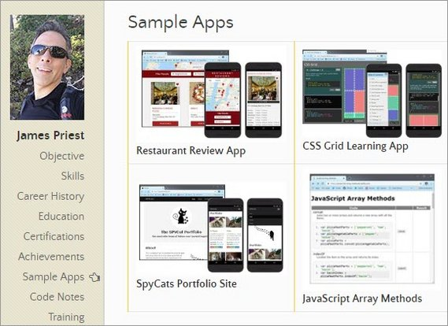](assets/images/code-log-38.jpg)

**Progress:** I added to my online resume and updated some portfolio apps.

Here's what was done:

- Deployed my Restaurant Review app to Netlify
- Updated CodePens & GitHub Page sites
- Added classes and courses I've taken to my resume
- Updated npm packages for each of my projects and resolved any package vulnerabilities

Items Remaining:

- Need to list all training and courses I've taken this year
- Need to build a stand alone portfolio site tpo showcase each project

**Links:**
- My CV Resume - [https://james-priest.github.io/](https://james-priest.github.io/)

---

## 37. UI/UX Form Update
### Day 37: December 2, 2018 - Sunday

**Project:** Host Restaurant Review app

[](https://james-priest.github.io/mws-restaurant-stage-1/assets/images/4-47.jpg)

**Progress:** Restaurant Review PWA migration

I'm still wiring up my PWA app to work with a new database back end.

Today's work involved:

- Update to the star rating control
- Update date display
- Update form display

[](https://james-priest.github.io/mws-restaurant-stage-1/assets/images/4-41.jpg)

[](https://james-priest.github.io/mws-restaurant-stage-1/assets/images/4-42.jpg)

You can read more here: [Restaurant Review App - Stage 4: Section 12. UI/UX Updates](https://james-priest.github.io/mws-restaurant-stage-1/stage4.html#12-uiux-updates).

**Links:**
- My Project Notes - [Restaurant Review App - Stage 4](https://james-priest.github.io/mws-restaurant-stage-1/stage4.html)
- GitHub Repo - [MWS Restaurant Stage 1](https://github.com/james-priest/mws-restaurant-stage-1) - Client App
- Udacity’s [Mobile Web Specialist Nanodegree Program](https://www.udacity.com/course/mobile-web-specialist-nanodegree--nd024) by Google (6 month course)

---

## 36. Edit Review Records
### Day 36: November 30, 2018 - Friday

**Project:** Host Restaurant Review app

[](https://james-priest.github.io/mws-restaurant-stage-1/assets/images/4-38.jpg)

**Progress:** Restaurant Review PWA migration

I'm still wiring up my PWA app to work with a new database back end.

Today's work involved:

- Wiring up the edit buttons to click handlers
- Writing code to pre-fill the input form with record data
- Validation, Error handling, fetch requests and offline queue

You can read more here: [Restaurant Review App - Stage 4: Section 11. Edit Review](https://james-priest.github.io/mws-restaurant-stage-1/stage4.html#11-edit-review).

**Links:**
- My Project Notes - [Restaurant Review App - Stage 4](https://james-priest.github.io/mws-restaurant-stage-1/stage4.html)
- GitHub Repo - [MWS Restaurant Stage 1](https://github.com/james-priest/mws-restaurant-stage-1) - Client App
- Udacity’s [Mobile Web Specialist Nanodegree Program](https://www.udacity.com/course/mobile-web-specialist-nanodegree--nd024) by Google (6 month course)

---

## 35. Refactor Modal Code
### Day 35: November 27, 2018 - Tuesday

**Project:** Host Restaurant Review app

[](https://james-priest.github.io/mws-restaurant-stage-1/assets/images/4-34.jpg)

**Progress:** Restaurant Review PWA migration

I'm still wiring up my PWA app to work with a new database back end.

Today's work involved:

- Creating a new modal dialog box
- Refactoring modal dialog code to work with add and delete operations
- Update app to work when offline
- Add sync remote database sync capability

You can read more here: [Restaurant Review App - Stage 4: Section 10. Delete Review](https://james-priest.github.io/mws-restaurant-stage-1/stage4.html#10-delete-review).

**Links:**
- My Project Notes - [Restaurant Review App - Stage 4](https://james-priest.github.io/mws-restaurant-stage-1/stage4.html)
- GitHub Repo - [MWS Restaurant Stage 1](https://github.com/james-priest/mws-restaurant-stage-1) - Client App
- Udacity’s [Mobile Web Specialist Nanodegree Program](https://www.udacity.com/course/mobile-web-specialist-nanodegree--nd024) by Google (6 month course)

---

## 34. Add Review Form
### Day 34: November 24, 2018 - Saturday

**Project:** Host Restaurant Review app

[](https://james-priest.github.io/mws-restaurant-stage-1/assets/images/4-31.jpg)

**Progress:** Restaurant Review PWA migration

I'm still wiring up my PWA app to work with a new database back end.

Today's work involved:

- Update fetch to use the new POST endpoint
- Test to make sure everything works properly

You can read more here: [Restaurant Review App - Stage 4: Section 9. POST Review](https://james-priest.github.io/mws-restaurant-stage-1/stage4.html#9-post-review).

**Links:**
- My Project Notes - [Restaurant Review App - Stage 4](https://james-priest.github.io/mws-restaurant-stage-1/stage4.html)
- GitHub Repo - [MWS Restaurant Stage 1](https://github.com/james-priest/mws-restaurant-stage-1) - Client App
- Udacity’s [Mobile Web Specialist Nanodegree Program](https://www.udacity.com/course/mobile-web-specialist-nanodegree--nd024) by Google (6 month course)

---

## 33. Favorite Button Toggle
### Day 33: November 22, 2018 - Thursday

**Project:** Host Restaurant Review app

[](https://james-priest.github.io/mws-restaurant-stage-1/assets/images/4-30.jpg)

**Progress:** Restaurant Review PWA migration

I'm still wiring up my PWA app to work with a new database backend.

Today's work involved:

- Using Postman to test the Ajax call for toggling favorite status
- Updating the client code to fetch with new url, method, & endpoint

You can read more here: [Restaurant Review App - Stage 4: Section 8. Favorite Toggle](https://james-priest.github.io/mws-restaurant-stage-1/stage4.html#8-favorite-toggle).

**Links:**
- My Project Notes - [Restaurant Review App - Stage 4](https://james-priest.github.io/mws-restaurant-stage-1/stage4.html)
- GitHub Repo - [MWS Restaurant Stage 1](https://github.com/james-priest/mws-restaurant-stage-1) - Client App
- Udacity’s [Mobile Web Specialist Nanodegree Program](https://www.udacity.com/course/mobile-web-specialist-nanodegree--nd024) by Google (6 month course)

---

## 32. Streamline Database
### Day 32: November 21, 2018 - Wednesday

**Project:** Host Restaurant Review app

[](https://james-priest.github.io/mws-restaurant-stage-1/assets/images/4-24.jpg)

**Progress:** Restaurant Review PWA migration

Today's work involved:

- Transitioning to use the database's internal system fields
- Eliminating duplicate fields
- Updating the code to reflect the new field names

You can read more here: [Restaurant Review App - Stage 4: Section 7. Streamlining Database](https://james-priest.github.io/mws-restaurant-stage-1/stage4.html#7-streamline-database).

**Links:**
- My Project Notes - [Restaurant Review App - Stage 4](https://james-priest.github.io/mws-restaurant-stage-1/stage4.html)
- GitHub Repo - [MWS Restaurant Stage 1](https://github.com/james-priest/mws-restaurant-stage-1) - Client App
- Udacity’s [Mobile Web Specialist Nanodegree Program](https://www.udacity.com/course/mobile-web-specialist-nanodegree--nd024) by Google (6 month course)

---

## 31. Edit & Delete Buttons
### Day 31: November 19, 2018 - Monday

**Project:** Host Restaurant Review app

[](https://james-priest.github.io/mws-restaurant-stage-1/assets/images/4-23.jpg)

**Progress:** Restaurant Review PWA migration

In order to host a copy of my version of the Mobile Web Restaurant Review app, I have to update the code to use a new series of REST endpoints.

These new endpoints are exposed by my hosted DB solution though [restdb.io](https://restdb.io).

Today's work involved:

- Adding Edit & Delete buttons to the Reviews section
- Writing code to programmatically build these
- Styling these to work in the layout

You can read more here: [Restaurant Review App - Stage 4: Section 6 Delete & Edit Buttons](https://james-priest.github.io/mws-restaurant-stage-1/stage4.html#6-delete--edit-buttons).

**Links:**
- My Project Notes - [Restaurant Review App - Stage 4](https://james-priest.github.io/mws-restaurant-stage-1/stage4.html)
- GitHub Repo - [MWS Restaurant Stage 1](https://github.com/james-priest/mws-restaurant-stage-1) - Client App
- Udacity’s [Mobile Web Specialist Nanodegree Program](https://www.udacity.com/course/mobile-web-specialist-nanodegree--nd024) by Google (6 month course)

---

## 30. Update REST Endpoints
### Day 30: November 18, 2018 - Sunday

**Project:** Host Restaurant Review app

[](https://james-priest.github.io/mws-restaurant-stage-1/assets/images/4-19.jpg)

**Progress:** Restaurant Review PWA migration

In order to host a copy of my version of the Mobile Web Restaurant Review app, I have to update the code to use a new series of REST endpoints.

These new endpoints are exposed by my hosted DB solution though [restdb.io](https://restdb.io).

Today's work involved:

- Update DB connection string and Headers object (CORS, API key, etc.)
- Update calls for GET restaurants and GET reviews by restaurant id.
- Update Service Worker to trap DB calls and return cached values if they exist

You can read more here: [Restaurant Review App - Stage 4: Section 4 Get Restaurants](https://james-priest.github.io/mws-restaurant-stage-1/stage4.html#4-get-restaurants).

**Links:**
- My Project Notes - [Restaurant Review App - Stage 4](https://james-priest.github.io/mws-restaurant-stage-1/stage4.html)
- GitHub Repo - [MWS Restaurant Stage 1](https://github.com/james-priest/mws-restaurant-stage-1) - Client App
- GitHub Repo - [MWS Restaurant Stage 2](https://github.com/james-priest/mws-restaurant-stage-2) - Server App
- GitHub Repo - [MWS Restaurant Stage 3](https://github.com/james-priest/mws-restaurant-stage-3) - Server App with additional Endpoints
- Udacity’s [Mobile Web Specialist Nanodegree Program](https://www.udacity.com/course/mobile-web-specialist-nanodegree--nd024) by Google (6 month course)

---

## 29. Swipe & Touch Support
### Day 29: November 16, 2018 - Friday

**Project:** Google Udacity Coursework

[](https://james-priest.github.io/udacity-nanodegree-mws/assets/images/wf4-1.jpg)

**Progress:** Elective coursework - High Conversion Web Forms

This course teaches how to build html5 web forms that are lean, streamlined, and effective. This lesson dealt with touch events on web forms.

Lesson 4 included:

- Touch vs Click
- Pseudo states (default, hover, focus, active)
- Suppressing text selection for touch & drag
- Proper touch feedback
- Working with both Touch & Mouse events

Read more: [High Conversion Web Forms: Touch Support](https://james-priest.github.io/udacity-nanodegree-mws/course-notes/high-conversion-web-forms.html#4-touch-support).

**Links:**
- My Course Notes - [High Conversion Web Forms](https://james-priest.github.io/udacity-nanodegree-mws/course-notes/high-conversion-web-forms.html)
- Udacity's [Building High Conversion Web Forms course](https://www.udacity.com/course/building-high-conversion-web-forms--ud890) by Google

---

## 28. Fast Web Forms
### Day 28: November 15, 2018 - Thursday

**Project:** Google Udacity Coursework

[](https://james-priest.github.io/udacity-nanodegree-mws/assets/images/wf3-10.jpg)

**Progress:** Elective coursework - High Conversion Web Forms

This course teaches how to build html5 web forms that are lean, streamlined, and effective. This lesson dealt with streamlining existing forms.

Lesson 3 reinforced the following principles.

- Keep forms short
- provide helpful prompts
- Provide immediate feedback
- Practice efficiency
- Utilize autofill & location services where appropriate
- Building a checkout

Read more: [High Conversion Web Forms: Fast Forms](https://james-priest.github.io/udacity-nanodegree-mws/course-notes/high-conversion-web-forms.html#3-fast-forms).

**Links:**
- Example [Checkout form](https://james-priest.github.io/udacity-nanodegree-mws/exercises/wf3-13/end/index.html)
- A simple pen on CodePen - [Responsive Mobile Ready Forms](https://codepen.io/james-priest/pen/PxbKdy)
- My Course Notes - [High Conversion Web Forms](https://james-priest.github.io/udacity-nanodegree-mws/course-notes/high-conversion-web-forms.html)
- Udacity's [Building High Conversion Web Forms course](https://www.udacity.com/course/building-high-conversion-web-forms--ud890) by Google

---

## 27. Web Forms Validation
### Day 27: November 14, 2018 - Wednesday

**Project:** Google Udacity Coursework

[](https://james-priest.github.io/udacity-nanodegree-mws/assets/images/wf2-22.jpg)

**Progress:** Elective coursework - High Conversion Web Forms

This course teaches how to build html5 web forms that are lean, streamlined, and effective. This lesson dealt with validation.

Lesson 2 started in with the following.

- `required` input fields
- numeric validation & range inputs
- `min`, `max`, and `step` attributes
- `setCustomValidity()` method of the Constraint Validation API

Read more: [High Conversion Web Forms: Validation](https://james-priest.github.io/udacity-nanodegree-mws/course-notes/high-conversion-web-forms.html#216-validation).

**Links:**
- Example responsive [Contact form](https://james-priest.github.io/udacity-nanodegree-mws/exercises/wf/contact.html)
- Example responsive [Shipping form](https://james-priest.github.io/udacity-nanodegree-mws/exercises/wf/shipping.html)
- A simple pen on CodePen - [Responsive Mobile Ready Forms](https://codepen.io/james-priest/pen/PxbKdy)
- My Course Notes - [High Conversion Web Forms](https://james-priest.github.io/udacity-nanodegree-mws/course-notes/high-conversion-web-forms.html)
- Udacity's [Building High Conversion Web Forms course](https://www.udacity.com/course/building-high-conversion-web-forms--ud890) by Google

---

## 26. Building Web Forms Pt2
### Day 26: November 11, 2018 - Sunday

**Project:** Google Udacity Coursework

[](https://james-priest.github.io/udacity-nanodegree-mws/assets/images/wf2-4.jpg)

**Progress:** Elective coursework - High Conversion Web Forms

This course teaches how to build html5 web forms that are lean, streamlined, and effective. This lesson is called Efficient Inputs.

Lesson 2 started in with the following.

- Proper use of `label`
- Sizing and positioning of `label` elements based on orientation
- Using `placeholder` attribute on `input` elements
- Calendars with `datetime-local`, `date`, and `time`

Read more: [High Conversion Web Forms: Efficient Inputs Part 2](https://james-priest.github.io/udacity-nanodegree-mws/course-notes/high-conversion-web-forms.html#2-efficient-inputs-pt-2).

**Links:**
- A simple pen on CodePen - [Responsive Mobile Ready Forms](https://codepen.io/james-priest/pen/PxbKdy)
- My Course Notes - [High Conversion Web Forms](https://james-priest.github.io/udacity-nanodegree-mws/course-notes/high-conversion-web-forms.html)
- Udacity's [Building High Conversion Web Forms course](https://www.udacity.com/course/building-high-conversion-web-forms--ud890) by Google

---

## 25. Building Web Forms Pt 1
### Day 25: November 10, 2018 - Saturday

**Project:** Google Udacity Coursework

[](https://james-priest.github.io/udacity-nanodegree-mws/assets/images/wf1-8.jpg)

**Progress:** Elective coursework - High Conversion Web Forms

This course teaches how to build html5 web forms that are lean, streamlined, and effective.

Lesson 1 deals with

- Good vs bad form design
- HTML5 inputs
- Datalist
- Form fixing strategies

Read more: [High Conversion Web Forms: Efficient Inputs Part 1](https://james-priest.github.io/udacity-nanodegree-mws/course-notes/high-conversion-web-forms.html#1-efficient-inputs-pt-1).

**Links:**
- My Course Notes - [High Conversion Web Forms](https://james-priest.github.io/udacity-nanodegree-mws/course-notes/high-conversion-web-forms.html)
- Udacity's [Building High Conversion Web Forms course](https://www.udacity.com/course/building-high-conversion-web-forms--ud890) by Google

---

## 24. Compositing & Painting
### Day 24: November 9, 2018 - Friday

**Project:** Google Udacity Nanodegree (Mobile Web Specialist) Coursework

[](https://james-priest.github.io/udacity-nanodegree-mws/assets/images/bro6-30.jpg)

**Progress:** Finished MWS coursework - Completed Browser Rendering Optimization course

Today I finished the last lesson of this course. It dealt with avoiding the pitfalls of compositing and painting with regards browser rendering.

It dealt with:

- Tracing problems
- Tracking layers
- Recording performance
- Managing performance budget per frame

Read more: [Browser Rendering Optimization: Compositing & Painting](https://james-priest.github.io/udacity-nanodegree-mws/course-notes/browser-rendering-optimization.html#14-compositing--painting).

**Links:**
- My Course Notes - [Browser Rendering Optimization](https://james-priest.github.io/udacity-nanodegree-mws/course-notes/browser-rendering-optimization.html)
- Udacity's [Browser Rendering Optimization course](https://www.udacity.com/course/browser-rendering-optimization--ud860) by Google
- Udacity’s [Mobile Web Specialist Nanodegree Program](https://www.udacity.com/course/mobile-web-specialist-nanodegree--nd024) by Google (6 month course)

---

## 23. Styles & Layout
### Day 23: November 7, 2018 - Wednesday

**Project:** Google Udacity Nanodegree (Mobile Web Specialist) Coursework

[](https://james-priest.github.io/udacity-nanodegree-mws/assets/images/bro5-18.jpg)

**Progress:** Finishing MWS coursework - Continued Browser Rendering Optimization course

Finished the fifth lesson on Optimization & Performance which dealt with Styles and Layout with regards to the render pipeline. It covered:

- The render pipeline
- Forced reflow and forced synchronous layout
- Layout thrashing
- Recording & measuring performance bottlenecks with DevTools

Read more: [Browser Rendering Optimization: Styles and Layout](https://james-priest.github.io/udacity-nanodegree-mws/course-notes/browser-rendering-optimization.html#13-styles-and-layout).

**Links:**
- My Course Notes - [Browser Rendering Optimization](https://james-priest.github.io/udacity-nanodegree-mws/course-notes/browser-rendering-optimization.html)
- Udacity's [Browser Rendering Optimization course](https://www.udacity.com/course/browser-rendering-optimization--ud860) by Google
- Udacity’s [Mobile Web Specialist Nanodegree Program](https://www.udacity.com/course/mobile-web-specialist-nanodegree--nd024) by Google (6 month course)

---

## 22. JS Web Workers
### Day 22: November 6, 2018 - Tuesday

**Project:** Google Udacity Nanodegree (Mobile Web Specialist) Coursework

[](https://james-priest.github.io/udacity-nanodegree-mws/assets/images/bro4-36.jpg)

**Progress:** Finishing MWS coursework - Continued Browser Rendering Optimization course

Finished the last part of the fourth lesson which dealt with JS memory management. It covered:

- More Memory Profiling for long running JS
- Moving code to Web Workers to free up main thread
- Using `requestAnimationFrame` instead of `setTimeout` & `setInterval`

Read more: [Browser Rendering Optimization: JavaScript Memory Management](https://james-priest.github.io/udacity-nanodegree-mws/course-notes/browser-rendering-optimization.html#128-js-memory-management).

**Links:**
- My Course Notes - [Browser Rendering Optimization](https://james-priest.github.io/udacity-nanodegree-mws/course-notes/browser-rendering-optimization.html)
- Udacity's [Browser Rendering Optimization course](https://www.udacity.com/course/browser-rendering-optimization--ud860) by Google
- Udacity’s [Mobile Web Specialist Nanodegree Program](https://www.udacity.com/course/mobile-web-specialist-nanodegree--nd024) by Google (6 month course)

---

## 21. JavaScript Performance
### Day 21: November 5, 2018 - Monday

**Project:** Google Udacity Nanodegree (Mobile Web Specialist) Coursework

[](https://james-priest.github.io/udacity-nanodegree-mws/assets/images/bro4-32.jpg)

**Progress:** Finishing MWS coursework - Continued Browser Rendering Optimization course

The fourth lesson dealt with the JavaScript Performance Debugging in Chrome's Debugging tools. It covered:

- JIT compilation
- Animation using `requestAnimationFrame`
- Memory Profiling & long running JS
- Web Workers
- Memory management

Read more: [Browser Rendering Optimization: JavaScript Debug](https://james-priest.github.io/udacity-nanodegree-mws/course-notes/browser-rendering-optimization.html#12-javascript-debug).

**Links:**
- My Course Notes - [Browser Rendering Optimization](https://james-priest.github.io/udacity-nanodegree-mws/course-notes/browser-rendering-optimization.html)
- Udacity's [Browser Rendering Optimization course](https://www.udacity.com/course/browser-rendering-optimization--ud860) by Google
- Udacity’s [Mobile Web Specialist Nanodegree Program](https://www.udacity.com/course/mobile-web-specialist-nanodegree--nd024) by Google (6 month course)

---

## 20. Debugging Performance
### Day 20: November 4, 2018 - Sunday

**Project:** Google Udacity Nanodegree (Mobile Web Specialist) Coursework

[](https://james-priest.github.io/udacity-nanodegree-mws/assets/images/bro3-4.jpg)

**Progress:** Finishing MWS coursework - Continued Browser Rendering Optimization course

The third Lesson dealt with the Performance panel in Chrome's Debugging tools. It covered:

- Recording activity
- Reading the timeline
- Flame and Waterfall charts
- Summary, Bottom Up, Call Tree, & Event Log views
- Remote debugging on mobile
- Identifying bottlenecks

Read more: [Browser Rendering Optimization: Debugging Tools](https://james-priest.github.io/udacity-nanodegree-mws/course-notes/browser-rendering-optimization.html#11-debug-tools).

**Links:**
- My Course Notes - [Browser Rendering Optimization](https://james-priest.github.io/udacity-nanodegree-mws/course-notes/browser-rendering-optimization.html)
- Udacity's [Browser Rendering Optimization course](https://www.udacity.com/course/browser-rendering-optimization--ud860) by Google
- Udacity’s [Mobile Web Specialist Nanodegree Program](https://www.udacity.com/course/mobile-web-specialist-nanodegree--nd024) by Google (6 month course)

---

## 19. App Lifecycle
### Day 19: November 3, 2018 - Saturday

**Project:** Google Udacity Nanodegree (Mobile Web Specialist) Coursework

[](https://james-priest.github.io/udacity-nanodegree-mws/assets/images/bro2-10.jpg)

**Progress:** Finishing MWS coursework - Continued Browser Rendering Optimization course

The second Lesson was called App Lifecycle and it dealt with

- RAIL (Render, Animate, Idle, Load) process
- Appropriate times for each phase
- Rendering animations
- fetching assets
- critical content for first load

[](https://james-priest.github.io/udacity-nanodegree-mws/assets/images/bro2-5.jpg)

Read more: [Browser Rendering Optimization: App Lifecycle](https://james-priest.github.io/udacity-nanodegree-mws/course-notes/browser-rendering-optimization.html#10-app-lifecycles).

**Links:**
- My Course Notes - [Browser Rendering Optimization](https://james-priest.github.io/udacity-nanodegree-mws/course-notes/browser-rendering-optimization.html)
- Udacity's [Browser Rendering Optimization course](https://www.udacity.com/course/browser-rendering-optimization--ud860) by Google
- Udacity’s [Mobile Web Specialist Nanodegree Program](https://www.udacity.com/course/mobile-web-specialist-nanodegree--nd024) by Google (6 month course)

---

## 18. Browser Rendering Performance
### Day 18: November 2, 2018 - Friday

**Project:** Google Udacity Nanodegree (Mobile Web Specialist) Coursework

[](https://james-priest.github.io/udacity-nanodegree-mws/assets/images/bro1-20.jpg)

**Progress:** Finishing MWS coursework - Started Browser Rendering Optimization course

The first Lesson is called The Critical Rendering Path and it covers the following

- 60 fps rendering
- Steps for rendering a single frame
- DOM & Render Tree
- Layout & Paint
- Compositing
- Using DevTools Performance panel

Read more: [Browser Rendering Optimization: The Critical Rendering Path](https://james-priest.github.io/udacity-nanodegree-mws/course-notes/browser-rendering-optimization.html#9-the-critical-rendering-path).

**Links:**
- My Course Notes - [Browser Rendering Optimization](https://james-priest.github.io/udacity-nanodegree-mws/course-notes/browser-rendering-optimization.html)
- Udacity's [Browser Rendering Optimization course](https://www.udacity.com/course/browser-rendering-optimization--ud860) by Google
- Udacity’s [Mobile Web Specialist Nanodegree Program](https://www.udacity.com/course/mobile-web-specialist-nanodegree--nd024) by Google (6 month course)

---

## 17. HTTP Servers & Protocols
### Day 17: November 1, 2018 - Thursday

**Project:** Google Udacity Nanodegree (Mobile Web Specialist) Coursework

[](https://james-priest.github.io/udacity-nanodegree-mws/assets/images/hws3-17.jpg)

**Progress:** Finishing MWS coursework - Finished HTTP & Web Servers course

This final section of this course covered a mix of subjects including the following.

- Multi-threading & concurrency
- Apache, Nginx, & IIS
- Cookies
- HTTPS & TLS
- HTTP Methods (verbs)
- HTTP/1.1 vs HTTP/2

Read more: [HTTP & Web Servers: Real Work HTTP: Multi-threaded Model](https://james-priest.github.io/udacity-nanodegree-mws/course-notes/http-web-servers.html#82-multi-threaded-model).

**Links:**
- [Mini Bookmark Server](https://mini-bookmark-server.herokuapp.com/) - Mini Bookmark HTTP  Server built in Python
- My Course Notes - [HTTP & Web Servers](https://james-priest.github.io/udacity-nanodegree-mws/course-notes/http-web-servers.html)
- Udacity's [HTTP & Web Servers course](https://www.udacity.com/course/http-web-servers--ud303) by Google
- Udacity’s [Mobile Web Specialist Nanodegree Program](https://www.udacity.com/course/mobile-web-specialist-nanodegree--nd024) by Google (6 month course)

---

## 16. Deploy to Heroku
### Day 16: October 31, 2018 - Wednesday

**Project:** Google Udacity Nanodegree (Mobile Web Specialist) Coursework

[](https://james-priest.github.io/udacity-nanodegree-mws/assets/images/hws3-2.jpg)

**Progress:** Finishing MWS coursework - Continued HTTP & Web Servers course

This section dealt with deploying a simple web server built with Python to Heroku. Specifically the lesson covered

- Signing up for a free Heroku account
- Installing the Heroku CLI
- Creating a set of config files including Procfile, requirements.txt, & runtime.txt
- Using Heroku environment variables
- Creating an app instance
- Pushing & building the app for deployment

Read more: [HTTP & Web Servers: Real Work HTTP: Deploy to Heroku](https://james-priest.github.io/udacity-nanodegree-mws/course-notes/http-web-servers.html#8-real-world-http).

**Links:**
- [Mini Bookmark Server](https://mini-bookmark-server.herokuapp.com/) - Mini Bookmark HTTP  Server built in Python
- My Course Notes - [HTTP & Web Servers](https://james-priest.github.io/udacity-nanodegree-mws/course-notes/http-web-servers.html)
- Udacity's [HTTP & Web Servers course](https://www.udacity.com/course/http-web-servers--ud303) by Google
- Udacity’s [Mobile Web Specialist Nanodegree Program](https://www.udacity.com/course/mobile-web-specialist-nanodegree--nd024) by Google (6 month course)

---

## 15. Python Web Servers
### Day 15: October 30, 2018 - Tuesday

**Project:** Google Udacity Nanodegree (Mobile Web Specialist) Coursework

[](https://james-priest.github.io/udacity-nanodegree-mws/assets/images/hws2-8.jpg)

**Progress:** Finishing MWS coursework - Continued HTTP & Web Servers course

This section dealt with creating HTTP Servers & Clients. It had us do the following:

- Use Python's `http.server` to write our own http servers
- Handle GET & POST requests
- Process QueryStrings & HTML forms
- Use Post-Redirect-to-Get server pattern
- Use `requests` package
- Handle JSON
- Build multiple HTTP servers

Read more: [HTTP & Web Servers: The Web from Python](https://james-priest.github.io/udacity-nanodegree-mws/course-notes/http-web-servers.html#7-the-web-from-python).

**Links:**
- My Course Notes - [HTTP & Web Servers](https://james-priest.github.io/udacity-nanodegree-mws/course-notes/http-web-servers.html)
- Udacity's [HTTP & Web Servers course](https://www.udacity.com/course/http-web-servers--ud303) by Google
- Udacity’s [Mobile Web Specialist Nanodegree Program](https://www.udacity.com/course/mobile-web-specialist-nanodegree--nd024) by Google (6 month course)

---

## 14. Requests & Responses
### Day 14: October 28, 2018 - Sunday

**Project:** Google Udacity Nanodegree (Mobile Web Specialist) Coursework

[](https://james-priest.github.io/udacity-nanodegree-mws/assets/images/hws1-12.jpg)

**Progress:** Continuing MWS coursework - Started HTTP & Web Servers course

The first section of this course covered HTTP Requests & Responses. It had us do the following:

- Install `ncat` command line util
- Spin up a Python http server
- Understand parts of the URI
- Experiment with GET requests
- Hand-code HTTP responses

Read more: [HTTP & Web Servers: Requests & Responses](https://james-priest.github.io/udacity-nanodegree-mws/course-notes/http-web-servers.html#6-requests--responses).

**Links:**
- My Course Notes - [HTTP & Web Servers](https://james-priest.github.io/udacity-nanodegree-mws/course-notes/http-web-servers.html)
- Udacity's [HTTP & Web Servers course](https://www.udacity.com/course/http-web-servers--ud303) by Google
- Udacity’s [Mobile Web Specialist Nanodegree Program](https://www.udacity.com/course/mobile-web-specialist-nanodegree--nd024) by Google (6 month course)

---

## 13. CORS & HTTP Security
### Day 13: October 27, 2018 - Saturday

**Project:** Google Udacity Nanodegree (Mobile Web Specialist) Coursework

[](https://james-priest.github.io/udacity-nanodegree-mws/assets/images/cs5-5.jpg)

**Progress:** Continuing MWS coursework - Completed Client-Server Communications course

The last section of this course dealt with CORS and HTTP security.

- same-origin-policy
- JSONP
- CORS requests
- Preflighting requests
- Security exploits

Read more: [Client-Server Communication: HTTP Security](https://james-priest.github.io/udacity-nanodegree-mws/course-notes/client-server-communication.html#5-security).

**Links:**
- My Course Notes - [Client-Server Communication](https://james-priest.github.io/udacity-nanodegree-mws/course-notes/client-server-communication.html#client-server-communication)
- Udacity’s [Mobile Web Specialist Nanodegree Program](https://www.udacity.com/course/mobile-web-specialist-nanodegree--nd024) by Google (6 month course)

---

## 12. HTTP/2
### Day 12: October 26, 2018 - Friday

**Project:** Google Udacity Nanodegree (Mobile Web Specialist) Coursework

[](https://james-priest.github.io/udacity-nanodegree-mws/assets/images/cs4-16.jpg)

**Progress:** Continuing MWS coursework - Client-Server Communications

I'm continuing with my Nanodegree coursework in preparation for the Google MWS certification test.

This lesson dealt with HTTP2.

The lesson covered..
- HTTP/1 problems
  - blocking
  - uncompressed headers
  - security
- HTTP/2 improvements
  - multiplexing
  - use of frames
- Best Practices
  - do's and dont's

Read more: [Client-Server Communication: HTTP/2](https://james-priest.github.io/udacity-nanodegree-mws/course-notes/client-server-communication.html#4-http2).

**Links:**
- My Course Notes - [Client-Server Communication](https://james-priest.github.io/udacity-nanodegree-mws/course-notes/client-server-communication.html#client-server-communication)
- Udacity’s [Mobile Web Specialist Nanodegree Program](https://www.udacity.com/course/mobile-web-specialist-nanodegree--nd024) by Google (6 month course)

---

## 11. HTTPS
### Day 11: October 25, 2018 - Thursday

**Project:** Google Udacity Nanodegree (Mobile Web Specialist) Coursework

[](https://james-priest.github.io/udacity-nanodegree-mws/assets/images/cs3-19.jpg)

**Progress:** Continuing MWS coursework - Client-Server Communications

I'm continuing with my Nanodegree coursework in preparation for the Google MWS certification test.

This lesson dealt with Secure HTTP or HTTPS.

The lesson covered..
- Secure HTTP
- Transport Layer Security (TLS was SSL)
- Hashing
- Cert Authorities
- TLS Handshake
- Mixed content

Read more: [Client-Server Communication: HTTPS](https://james-priest.github.io/udacity-nanodegree-mws/course-notes/client-server-communication.html#3-https).

**Links:**
- My Course Notes - [Client-Server Communication](https://james-priest.github.io/udacity-nanodegree-mws/course-notes/client-server-communication.html#client-server-communication)
- Udacity’s [Mobile Web Specialist Nanodegree Program](https://www.udacity.com/course/mobile-web-specialist-nanodegree--nd024) by Google (6 month course)

---

## 10. Test REST API with Postman
### Day 10: October 24, 2018 - Wednesday

**Project:** Host Restaurant Review app

[](https://james-priest.github.io/mws-restaurant-stage-1/assets/images/4-18.jpg)

**Progress:** Restaurant Review PWA migration

As part of the work required to host a copy of my version of the Udacity Mobile Web Nanodegree Restaurant app, I have to change all the Ajax requests to use my new hosted DB solution.

I chose a great hosted solution made available by [restdb.io](https://restdb.io).

Their service allowed me to:

- Create a NoSQL DB
- Create collections and define their fields
- Populate these with data
- Access the data through an instantly available REST API

The next part involved constructing all the new requests and testing each of the new endpoints to ensure I was able to perform each operation as expected.

I first started by identifying each endpoint I'm currently using from my local DB. I then read RestDB's excellent docs on how to build equivalent requests to access the same data.

I used [Postman](https://www.getpostman.com/) to track, build, & test each request.

You can read more here: [Restaurant Review App - Stage 4: Section 3 Test REST API](https://james-priest.github.io/mws-restaurant-stage-1/stage4.html#3-test-rest-api).

**Links:**
- My Project Notes - [Restaurant Review App - Stage 4](https://james-priest.github.io/mws-restaurant-stage-1/stage4.html)
- GitHub Repo - [MWS Restaurant Stage 1](https://github.com/james-priest/mws-restaurant-stage-1) - Client App
- GitHub Repo - [MWS Restaurant Stage 2](https://github.com/james-priest/mws-restaurant-stage-2) - Server App
- GitHub Repo - [MWS Restaurant Stage 3](https://github.com/james-priest/mws-restaurant-stage-3) - Server App with additional Endpoints
- Udacity’s [Mobile Web Specialist Nanodegree Program](https://www.udacity.com/course/mobile-web-specialist-nanodegree--nd024) by Google (6 month course)

---

## 9. RestDB.io Hosted DB
### Day 9: October 23, 2018 - Tuesday

**Project:** Host Restaurant Review app

[](https://james-priest.github.io/mws-restaurant-stage-1/assets/images/4-2.jpg)

**Progress:** Restaurant Review PWA migration

I've settled on a great Database-as-a-Service (DBaaS) offering. They allow you to

- Create a NoSQL database
- Define the schema and model
- Populate it with data
- Query against it using an auto-generated REST API
- Free to set up a Developer account

This was perfect for replicating the local Node.js/Sails.js database that was provided us. And it relieves me from having to find a hosted Node.js solution.

Now I can change my Ajax calls to point to and use my new data source and be up and running.

See the code notes here: [Restaurant Review App - Stage 4: Section 2 Build Database](https://james-priest.github.io/mws-restaurant-stage-1/stage4.html#2-build-database).

**Links:**
- My Project Notes - [Restaurant Review App - Stage 4](https://james-priest.github.io/mws-restaurant-stage-1/stage4.html)
- GitHub Repo - [MWS Restaurant Stage 1](https://github.com/james-priest/mws-restaurant-stage-1) - Client App
- GitHub Repo - [MWS Restaurant Stage 2](https://github.com/james-priest/mws-restaurant-stage-2) - Server App
- GitHub Repo - [MWS Restaurant Stage 3](https://github.com/james-priest/mws-restaurant-stage-3) - Server App with additional Endpoints
- Udacity’s [Mobile Web Specialist Nanodegree Program](https://www.udacity.com/course/mobile-web-specialist-nanodegree--nd024) by Google (6 month course)

---

## 8. Cloud Services Defined
### Day 8: October 22, 2018 - Monday

**Project:** Host Restaurant Review app

[](https://james-priest.github.io/mws-restaurant-stage-1/assets/images/4-1.jpg)

**Progress:** Restaurant Review PWA migration

The nanodegree only had three stages to complete in order to meet all requirements.

I’m adding a fourth stage which will include necessary changes to properly host this app as part of my online portfolio.

I started researching various Cloud services in order to find a solution to host the Restaurant app's back end database and REST API.

In that effort I documented the following in my code notes

- Wrote out a set of requirements
- Researched NoSQL Databases
- Learned about & defined various cloud services (IaaS, PaaS, DBaaS, SaaS)
- Investigated hosted DB Solutions

See the code notes here: [Restaurant Review App - Stage 4: Section 1 NoSQL with RESTful API](https://james-priest.github.io/mws-restaurant-stage-1/stage4.html#14-stage-3-review).

**Links:**
- My Project Notes - [Restaurant Review App - Stage 4](https://james-priest.github.io/mws-restaurant-stage-1/stage4.html)
- GitHub Repo - [MWS Restaurant Stage 1](https://github.com/james-priest/mws-restaurant-stage-1) - Client App
- GitHub Repo - [MWS Restaurant Stage 2](https://github.com/james-priest/mws-restaurant-stage-2) - Server App
- GitHub Repo - [MWS Restaurant Stage 3](https://github.com/james-priest/mws-restaurant-stage-3) - Server App with additional Endpoints
- Udacity’s [Mobile Web Specialist Nanodegree Program](https://www.udacity.com/course/mobile-web-specialist-nanodegree--nd024) by Google (6 month course)

---

## 7. HTTP 1.1
### Day 7: October 15, 2018 - Monday

**Project:** Google Udacity Nanodegree (Mobile Web Specialist) Coursework

[](https://james-priest.github.io/udacity-nanodegree-mws/assets/images/cs2-9.jpg)

**Progress:** Continuing MWS coursework - Client-Server Communications

So, now that I've successfully completed the Nanodegree requirements I've set my sights on taking the Google MWS certification test. In order to be best prepared, I'll complete the remaining coursework first.

HTTP 1.1 deals with the following..
- Request headers
- HTTP Verbs
- Common Response headers
- Performance Basics

Read more: [Client-Server Communication: HTTP/1](https://james-priest.github.io/udacity-nanodegree-mws/course-notes/client-server-communication.html#2-http1).

**Links:**
- My Course Notes - [Client-Server Communication](https://james-priest.github.io/udacity-nanodegree-mws/course-notes/client-server-communication.html#client-server-communication)
- Udacity’s [Mobile Web Specialist Nanodegree Program](https://www.udacity.com/course/mobile-web-specialist-nanodegree--nd024) by Google (6 month course)

---

## 6. Restaurant App - Stage 3 Project Results
### Day 6: October 12, 2018 - Friday

**Project:** Google Udacity Nanodegree (Mobile Web Specialist)

[](https://james-priest.github.io/mws-restaurant-stage-1/assets/images/3-31.jpg)

**Progress:** Completed the *Restaurant Reviews App - Stage 3* project.

I submitted my project for review and got the results back.  It passed with flying colors which made the extra weeks I put into it worth while.

One thing that threw me off though was the first line of the reviewer's feedback, "where he said, "Great attempt". Whad'ya mean "Great attempt?!?".😂😂

It then went on to tell me that I had in fact completed the nanodegree! Whew!😅

[](https://james-priest.github.io/mws-restaurant-stage-1/assets/images/3-33.jpg)

See the code notes here: [Restaurant Review App - Stage 3: Section 14 Stage 3 Review](https://james-priest.github.io/mws-restaurant-stage-1/stage3.html#14-stage-3-review).

**Links:**
- My Project Notes - [Restaurant Review App - Stage 3](https://james-priest.github.io/mws-restaurant-stage-1/stage3.html)
- GitHub Repo - [MWS Restaurant Stage 1](https://github.com/james-priest/mws-restaurant-stage-1) - Client App
- GitHub Repo - [MWS Restaurant Stage 2](https://github.com/james-priest/mws-restaurant-stage-2) - Server App
- GitHub Repo - [MWS Restaurant Stage 3](https://github.com/james-priest/mws-restaurant-stage-3) - Server App with additional Endpoints
- Udacity’s [Mobile Web Specialist Nanodegree Program](https://www.udacity.com/course/mobile-web-specialist-nanodegree--nd024) by Google (6 month course)

---

## 5. Restaurant App - Stage 3 Performance Tuning
### Day 5: October 11, 2018 - Thursday

**Project:** Google Udacity Nanodegree (Mobile Web Specialist)

[](https://james-priest.github.io/mws-restaurant-stage-1/assets/images/3-23.jpg)

**Progress:** Completed the *Restaurant Reviews App - Stage 3* project.

This last part required me to tighten up the performance scores on this app.

I ran the tests from Chrome's DevTools audits panel and did the following to bring the scores up

- Created gulp tasks to inline my js and css
- Reduced image quality (and file size) in my image compression gulp task

The new scores are enough to pass!

[](https://james-priest.github.io/mws-restaurant-stage-1/assets/images/3-28.jpg)

See the code notes here: [Restaurant Review App - Stage 3: Section 13 Performance Tuning](https://james-priest.github.io/mws-restaurant-stage-1/stage3.html#13-performance-tuning).

**Links:**
- My Project Notes - [Restaurant Review App - Stage 3](https://james-priest.github.io/mws-restaurant-stage-1/stage3.html)
- GitHub Repo - [MWS Restaurant Stage 1](https://github.com/james-priest/mws-restaurant-stage-1) - Client App
- GitHub Repo - [MWS Restaurant Stage 2](https://github.com/james-priest/mws-restaurant-stage-2) - Server App
- GitHub Repo - [MWS Restaurant Stage 3](https://github.com/james-priest/mws-restaurant-stage-3) - Server App with additional Endpoints
- Udacity’s [Mobile Web Specialist Nanodegree Program](https://www.udacity.com/course/mobile-web-specialist-nanodegree--nd024) by Google (6 month course)

---

## 4. Restaurant App - Stage 3 Offline Favorites
### Day 4: October 9, 2018 - Tuesday

**Project:** Google Udacity Nanodegree (Mobile Web Specialist)

[](https://james-priest.github.io/mws-restaurant-stage-1/assets/images/3-21.jpg)

**Progress:** Continued the *Restaurant Reviews App - Stage 3* project.

I completed the last piece of functionality for this app which is the ability to mark a restaurant as a favorite while the app is offline.

I added the following:

- Set click handlers for the favorite buttons
- Created a function to use Fetch API when updating the online DB
- Added error handling which updates the data locally
- Created code to save all requests when offline and then send to server when connected once again.

See the code notes here: [Restaurant Review App - Stage 3: Section 12 Offline Favorites](https://james-priest.github.io/mws-restaurant-stage-1/stage3.html#12-offline-favorites).

**Links:**
- My Project Notes - [Restaurant Review App - Stage 3](https://james-priest.github.io/mws-restaurant-stage-1/stage3.html)
- GitHub Repo - [MWS Restaurant Stage 1](https://github.com/james-priest/mws-restaurant-stage-1) - Client App
- GitHub Repo - [MWS Restaurant Stage 2](https://github.com/james-priest/mws-restaurant-stage-2) - Server App
- GitHub Repo - [MWS Restaurant Stage 3](https://github.com/james-priest/mws-restaurant-stage-3) - Server App with additional Endpoints
- Udacity’s [Mobile Web Specialist Nanodegree Program](https://www.udacity.com/course/mobile-web-specialist-nanodegree--nd024) by Google (6 month course)

---

## 3. Restaurant App - Stage 3 Kill Page Refresh
### Day 3: October 7, 2018 - Sunday

**Project:** Google Udacity Nanodegree (Mobile Web Specialist)

[](https://james-priest.github.io/mws-restaurant-stage-1/assets/images/3-20.jpg)

**Progress:** Continued the *Restaurant Reviews App - Stage 3* project.

There were two places in my app where I was lazily reloading the page in order to redraw the data on the page.

This was clunky and didn't make sense to do since I was using Ajax everywhere else to eliminate round-trips to the server.

See the code notes here: [Restaurant Review App - Stage 3: Section 11 Kill Page Refresh](https://james-priest.github.io/mws-restaurant-stage-1/stage3.html#11-kill-page-refresh).

**Links:**
- My Project Notes - [Restaurant Review App - Stage 3](https://james-priest.github.io/mws-restaurant-stage-1/stage3.html)
- GitHub Repo - [MWS Restaurant Stage 1](https://github.com/james-priest/mws-restaurant-stage-1) - Client App
- GitHub Repo - [MWS Restaurant Stage 2](https://github.com/james-priest/mws-restaurant-stage-2) - Server App
- GitHub Repo - [MWS Restaurant Stage 3](https://github.com/james-priest/mws-restaurant-stage-3) - Server App with additional Endpoints
- Udacity’s [Mobile Web Specialist Nanodegree Program](https://www.udacity.com/course/mobile-web-specialist-nanodegree--nd024) by Google (6 month course)

---

## 2. Restaurant App - Stage 3 Post Offline Data
### Day 2: October 6, 2018 - Saturday

**Project:** Google Udacity Nanodegree (Mobile Web Specialist)

[](https://james-priest.github.io/mws-restaurant-stage-1/assets/images/3-15.jpg)

**Progress:** Continued the *Restaurant Reviews App - Stage 3* project.

In this part of my project I finished the offline data processing queue. This is responsible for sending offline review data to the server once connectivity is re-established.

The code does the following:
1. On page load it gets the all offline requests as an IDB cursor
2. It opens the first request and attempts to POST it with fetch
3. If we are offline then it skips to the next and tries again
4. Once we do successfully POST we get the resulting record back
5. We then delete the offline request from the offline store
6. We add the new review record and delete the old record from reviews store
7. The add & delete is done in the same transaction so if it fails it rolls back

See the code notes here: [Restaurant Review App - Stage 3: Section 10 Post Offline Data](https://james-priest.github.io/mws-restaurant-stage-1/stage3.html#10-post-offline-data).

**Links:**
- My Project Notes - [Restaurant Review App - Stage 3](https://james-priest.github.io/mws-restaurant-stage-1/stage3.html)
- GitHub Repo - [MWS Restaurant Stage 1](https://github.com/james-priest/mws-restaurant-stage-1) - Client App
- GitHub Repo - [MWS Restaurant Stage 2](https://github.com/james-priest/mws-restaurant-stage-2) - Server App
- GitHub Repo - [MWS Restaurant Stage 3](https://github.com/james-priest/mws-restaurant-stage-3) - Server App with additional Endpoints
- Udacity’s [Mobile Web Specialist Nanodegree Program](https://www.udacity.com/course/mobile-web-specialist-nanodegree--nd024) by Google (6 month course)

---

## 1. Created Round 4 Code Log
### Day 1: October 5, 2018 - Friday

**Project:** Google Udacity Nanodegree (Mobile Web Specialist)

[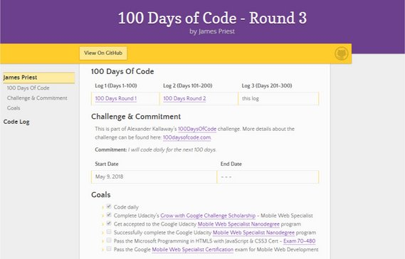](assets/images/code-log-1.jpg)

**Progress:** Created a new GitHub repo for my Round 4 code log.

This now uses a dusky rose theme and has an updated nav which I've migrated over to my previous two logs.

I'm still finishing up my Udacity Mobile Web Specialist Nanodegree...

Hopefully will be done in another week...

**Links:** My GitHub repo [https://github.com/james-priest/100-days-of-code-log-r4](https://github.com/james-priest/100-days-of-code-log-r4)